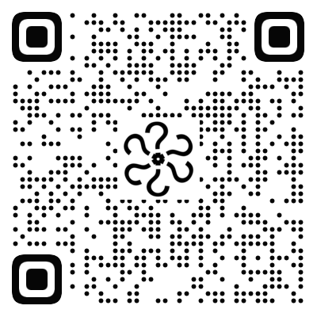
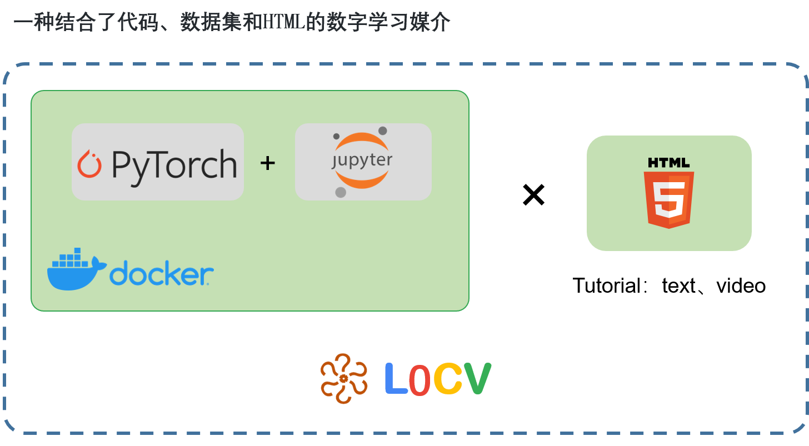

<p align="right">
<a href="https://github.com/Charmve">
    
	<!---- comesfrom https://techsini.com/multi-mockup/index.php --->
</a>
</p>

<!-- maiweilab
<div id="outputFigDisplay" class="fig">
    <pre id="taag_output_text" style="left;" class="flag" contenteditable="true">
    <code>
    __  ___      _               _ ___    ____                             
   /  |/  /___ _(_)      _____  (_)   |  /  _/    _________  ____ ___      
  / /|_/ / __ `/ / | /| / / _ \/ / /| |  / /_____/ ___/ __ \/ __ `__ \     
 / /  / / /_/ / /| |/ |/ /  __/ / ___ |_/ /_____/ /__/ /_/ / / / / / /     
/_/  /_/\__,_/_/ |__/|__/\___/_/_/  |_/___/     \___/\____/_/ /_/ /_/      
    </code>
    </pre>
</div>

## Maiwei AI Lab - <ins>迈微AI研习社</ins><sup><a href="https://mp.weixin.qq.com/s/jr6h1lXxWsQLF8GZnek7Fg">[?]</a></sup>

<a href="https://www.github.com/Charmve" target="_blank"></a>
<a href="https://github.com/Charmve/computer-vision-in-action#关注我们" target="_blank"></a>

作者系迈微AI研习社创始人、CSDN博客专家，主要分享机器学习算法、计算机视觉等相关内容，每周研读顶会论文，持续关注前沿技术动态。公众号底部有菜单分类，关注我们，一起学习成长。
 
---
-->

<!--
<table>
<tr>
	<td>
	## ✨ News! ✨

	- <b>2020.07.12:</b> 📝  进阶篇 更新Transformer、强化学习、迁移学习、视频理解 !
	- <b>2021.06.20:</b> 📘  在线电子书发布  ! <a href="https://charmve.github.io/computer-vision-in-action/" target="_blank"></a>
	- <b>2020.06.10:</b> 💻  L0CV 项目主页发布 ！ <a href="https://charmve.github.io/L0CV-web/" target="_blank"></a>

	更多更新日志会同步到 [CHANGELOG](CHANGELOG.md)，持续更新中，感谢大家的支持与喜欢！
	</td>
</tr>
</table>
-->

> "如果你只是看了这个项目的在线文档，那么你并没有利用好这个项目。太可惜！"

<a href="https://charmve.github.io/computer-vision-in-action">
    
</a>

## ✨ 以用促学，先会后懂 ✨
### L0CV <sup><a href="https://charmve.github.io/L0CV-web/">`🔊`</a></sup> &nbsp; 一种结合了代码、图示和HTML的在线学习媒介
<br>

<table align="center">
<tr>
<td>
<code>全面</code>&nbsp;<code>前沿</code>&nbsp;<code>免费</code>
<h1> 计算机视觉实战演练：算法与应用 <sup> 📌</sup>
<br><em>Computer Vision in Action</em></h1>

[作者：张伟（Charmve）](https://github.com/Charmve)

<p align="center">
	<a href="https://circleci.com/gh/Charmve/computer-vision-in-action"></a>
	<a href="https://charmve.github.io/computer-vision-in-action"></a>
	<a href="https://www.apache.org/licenses/LICENSE-2.0" target="_blank" style="display:inline-block"></a>
  <a rel="DocLicense" href="http://creativecommons.org/licenses/by-nc-sa/4.0/"></a>
	<br><a href="https://github.com/Charmve/computer-vision-in-action/tree/main/code/"></a>
  <a href="https://github.com/Charmve/computer-vision-in-action/tree/main/notebooks/"></a>
  <a href="https://pytorch.org/"></a>
	<br><a href="https://mybinder.org/v2/gh/Charmve/computer-vision-in-action/main/notebooks/"></a>
	<a href="https://github.com/Charmve/computer-vision-in-action/tree/main/code/"></a>
	<a href="https://github.com/Charmve/computer-vision-in-action/tree/main/docker"></a>
  <a href="https://gitpod.io/#https://github.com/Charmve/computer-vision-in-action"></a>
  <a href="https://github.com/Charmve/computer-vision-in-action/edit/master/README.md"></a>
  <a href="https://github.com/Charmve/computer-vision-in-action/edit/master/README.md"></a>
</p>

<div align="center">
	
</div>

<br><br>
<a href="https://charmve.github.io/L0CV-web/" target="_blank"></a>
<a href="https://charmve.github.io/computer-vision-in-action/" target="_blank"></a>

跨平台，只需一个浏览器即可！
<br>
> <h4>👉  在线阅读（优先更新实战篇和进阶篇）</h4>
> - 地址：https://charmve.github.io/computer-vision-in-action/

> <h4>最新版PDF下载</h4>
> - 地址：https://github.com/charmve/computer-vision-in-action/releases <b>(马上来 ...)</b>

</tr>
</td>
</table>

<div align="right">

<details><summary>分享 <code><a target="_blank" href="https://user-images.githubusercontent.com/29084184/126729326-cad7a288-e424-4f69-a47a-90f61e7d9879.png"></a></code> 到 </summary></details>
<code><a href="http://qq.com/intent/qq?text=https://github.com/Charmve/computer-vision-in-action"></a></code>
<code><a href="http://mp.weixin.qq.com/intent/wechat?text=https://github.com/Charmve/computer-vision-in-action"></a></code>
<code><a href="http://weibo.com/intent/weibo?text=https://github.com/Charmve/computer-vision-in-action"></a></code>
<code><a href="http://twitter.com/intent/tweet?text=https://github.com/Charmve/computer-vision-in-action"></a></code>
<code><a href="https://www.zhihu.com/"></a></code>
<code><a href="https://blink.csdn.net/"></a></code>

</div>

## Index



- [💠 全书组织](#-全书组织)
- [🌈 愿景](#-愿景)
- [📘 本书目录](#-本书目录)
- [🔍 文件浏览](#-文件浏览)
- [🌼 L0CV-DemoDay](#l0cv-demoday)
- [🔑 如何食用](#-如何食用)
- [❓ 常见问题](#-常见问题)
- [👥 社区互助](#-社区互助)
- [:heart: 致谢](#致谢)
- [📄 LICENSE](#license)
- [👐 参与项目](#contribution)
- [🤝 关注我们](#关注我们)
- [📎 Citation](#citation)

<p align="right">
	:label: <code>sec_code</code> <b>图1 L0CV 结构图</b>
</p> 

## 💠 全书组织
:label: `fig_book_org`

<p align="center">
  
</p> 

<p align="right">
  <a href="res/计算机视觉实战演练：算法与应用_思维导图.pdf">全书详细思维导图</a>
</p>

本书详细介绍，请移步 [<b>序言</b>](/docs/book_preface.md)。

* 第一部分包括基础知识和预备知识。提供深度学习的入门课程，然后在理论篇中，将快速向你介绍实践计算机视觉所需的前提条件，例如如何存储和处理数据，以及如何应用基于线性代数、微积分和概率基本概念的各种数值运算，涵盖了深度学习的最基本概念和技术，例如线性回归、多层感知机和正则化。

* 第二部分是本书涉及的计算机视觉基础理论，核心部分为神经网络模型，包括神经网络、卷积神经网络、循环神经网络理论讲解，以图像分类、模型拟合与优化作为其代码的实战项目。在模型拟合和优化章节中，着重分享梯度下降、随机梯度下降、动量法、AdaBoost等方法。

* 接下来的七章集中讨论现代计算机视觉技术实战，也是本书的核心部分。围绕这样的组织逻辑：什么是计算机视觉？计算机视觉解决什么问题，都是怎么解决的？传统方法——以卷积神经网络为中心的神经网络；现代方法——Transformer、强化学习、迁移学习、生成对抗等。各种方法是如何实现的，用到了什么框架？在第7章中，描述了计算机视觉的经典卷积神经网络PyTorch实现，并为我们随后实现更复杂的模型奠定了基础。在随后的几个章节中，我们主要解决图像分类、目标检测、语义分割、3D重建等实际问题，并给出实战项目。

* 该部分以项目为实战指导，给出详细的项目指导书和代码实现，更为特别的是，给出了**notebook**可以直接在线运行，跑通结果，免去了本地运行环境的搭建复杂性。于此同时，为了方便读者在本地调试，作者建立了一个名为 ``L0CV`` 的第三方包，可以直接在代码中 ``import L0CV`` 后使用。

* 第三部分讨论最近几年出现的<b>“网红”模型</b>，诸如：Transformer、Attention、知识蒸馏、迁移学习、生成对抗模型等。这部分也是此份资料的力挺之作。最后，在 `chap_optimization` 中，我们讨论了用于训练深度学习模型的几种常用优化算法，如：模型压缩、模型剪枝、微调、蒸馏等。

[Index](#-以用促学先会后懂-)

## 🌈 愿景

本开源项目代表了我们的一种尝试：我们将教给读者概念、背景知识和代码；我们将在同一个地方阐述剖析问题所需的批判性思维、解决问题所需的数学知识，以及实现解决方案所需的工程技能。

我们的目标是创建一个为实现以下目标的统一资源：
1. 所有人均可在网上免费获取；
2. 提供足够的技术深度，从而帮助读者实际成为计算机视觉应用科学家：既理解数学原理，又能够实现并不断改进方法；
3. 包含可运行的代码，为读者展示如何在实际中解决问题。这样不仅直接将数学公式对应成实际代码，而且可以修改代码、观察结果并及时获取经验；
4. 允许我们和整个[社区](https://github.com/Charmve/computer-vision-in-action/discussions)不断快速迭代内容，从而紧跟仍在高速发展的计算机视觉领域；
5. 由包含有关技术细节问答的论坛作为补充，使大家可以相互答疑并交换经验。

[Index](#-以用促学先会后懂-)

<br>

## 📘 本书目录

> <h4>👉  在线阅读（优先更新实战篇和进阶篇）</h4>
> - 地址：https://charmve.github.io/computer-vision-in-action/

<details><summary>📘 详细目录(点击展开)</summary>
	
<table align="center">
<tr>
<td>

- <b><h4>[序言](/docs/book_preface.md)</h4></b>
- <b><h4>主要符号表</h4></b>
- <b><h4>绪论篇</h4></b>
  - 第 0 章  [计算机视觉概述](https://charmve.github.io/computer-vision-in-action/#/chapter0/chapter0)
    - 0.1 [概述](docs/0_绪论/chapter0.1_概述.md)
	  - 0.1.1 什么是计算机视觉
	  - 0.1.2 计算机视觉解决什么问题
	  - 0.1.3 行业应用
    - 0.2 [计算机视觉基本概念](docs/0_绪论/chapter0.2_计算机视觉基本概念.md)
    - 0.3 [发展历史回顾](docs/0_绪论/chapter0.3_发展历史回顾.md)
    - 0.4 [典型的计算机视觉任务](docs/0_绪论/chapter0.4_典型的计算机视觉任务.md)
      - 图像分类 
      - 目标识别与目标检测
      - 实例分割与语义分割
      - 3D 建模
	- 0.5 [国内外优秀的计算机视觉团队汇总](docs/0_绪论/chapter0.5_国内外优秀的计算机视觉团队汇总.md)
    - 小练习
    - 小结
    - 参考文献
- <b><h4>理论篇</h4></b>
  - 第 1 章 [神经网络](https://charmve.github.io/computer-vision-in-action/#/chapter2/chapter2)
    - 1.1 [线性回归](/1_理论篇/chapter1_Neural-Networks/chapter1.1_line-regression.md)
      - 1.1.1 基本原理
      - 1.1.2 从零实现线性回归
      - 1.1.3 线性回归的简洁实现
    - 1.2 [Softmax 回归](./docs/1_理论篇/chapter3_Image-Classification/chapter1.2_Softmax回归.md)
      - 1.2.1 softmax回归模型
      - 1.2.2 从零开始实现softmax回归
      - 1.2.3 softmax回归的简洁实现
    - 1.3 [多层感知器](./docs/1_理论篇/chapter1_Neural-Networks/chapter1.3_多层感知器MLP.md)
      - 1.3.1 基本原理
      - 1.3.2 从零开始实现多层感知器
      - 1.3.3 多层感知器的简洁实现
    - 1.4 [反向传播算法](./docs/1_理论篇/chapter1_Neural-Networks/chapter1.4_Back-Propagation.md)
    - 1.5 [神经网络](./docs/1_理论篇/chapter1_Neural-Networks/chapter1.5_neural-networks.md)
      - 1.5.1 [神经学观点](./docs/1_理论篇/chapter1_Neural-Networks/chapter1.5.1_神经学观点.md)
      - 1.5.2 [神经网络1-建立神经网络架构](https://cs231n.github.io/neural-networks-1/)
      - 1.5.3 [神经网络2-设置数据和损失](https://cs231n.github.io/neural-networks-2/)
      - 1.5.4 [神经网络3-学习和评估](https://cs231n.github.io/neural-networks-3/)
      - 1.5.5 [案例分析-最小神经网络案例研究](https://cs231n.github.io/neural-networks-case-study/)
    - 1.6 [实战项目 1 - 手写字分类](https://blog.csdn.net/Charmve/article/details/108531735)
    - 小结
    - 参考文献
  - 第 2 章 [卷积神经网络](docs/1_理论篇/chapter2_CNN/chapter2_CNN.md)
    - 2.1 [从神经网络到卷积神经网络](docs/1_理论篇/chapter2_CNN/chapter2_CNN.md#21-从神经网络到卷积神经网络)
      - 2.1.1 [定义](/docs/1_理论篇/chapter2_CNN/chapter2_CNN.md#211-定义)
      - 2.1.2 [卷积神经网络的架构](/docs/1_理论篇/chapter2_CNN/chapter2_CNN.md#212-卷积神经网络的架构)
    - 2.2 [卷积网络的层级结构](/docs/1_理论篇/chapter2_CNN/chapter2_CNN.md#22-卷积网络的层级结构)
      - 2.2.1 [数据输入层](/docs/1_理论篇/chapter2_CNN/chapter2_CNN.md#221-数据输入层)
      - 2.2.2 [卷积计算层](/docs/1_理论篇/chapter2_CNN/chapter2_CNN.md#222-卷积计算层)
      - 2.2.3 [非线性层（或激活层）](/docs/1_理论篇/chapter2_CNN/chapter2_CNN.md#223-非线性层或激活层)
      - 2.2.4 [池化层](/docs/1_理论篇/chapter2_CNN/chapter2_CNN.md#224-池化层)
      - 2.2.5 [全连接层](/docs/1_理论篇/chapter2_CNN/chapter2_CNN.md#225-全连接层)
    - 2.3 [卷积神经网络的几点说明](/docs/1_理论篇/chapter2_CNN/chapter2_CNN.md#23-卷积神经网络的几点说明)
    - 2.4 [实战项目 2 - 动手搭建一个卷积神经网络](/docs/1_理论篇/chapter2_CNN/chapter2_CNN-in-Action.md)
      - 2.4.1 [卷积神经网络的前向传播](/docs/1_理论篇/chapter2_CNN/chapter2_CNN-in-Action.md#271-卷积神经网络的前向传播)
      - 2.4.2 [卷积神经网络的反向传播](/docs/1_理论篇/chapter2_CNN/chapter2_CNN-in-Action.md#272-卷积神经网络的反向传播)
      - 2.4.3 [手写一个卷积神经网络](/docs/1_理论篇/chapter2_CNN/chapter2_CNN-in-Action.md#273-手写一个卷积神经网络)
        - [1. 定义一个卷积层](/docs/1_理论篇/chapter2_CNN/chapter2_CNN-in-Action.md#1-定义一个卷积层)
        - [2. 构造一个激活函数](/docs/1_理论篇/chapter2_CNN/chapter2_CNN-in-Action.md#2-构造一个激活函数)
        - [3. 定义一个类，保存卷积层的参数和梯度](/docs/1_理论篇/chapter2_CNN/chapter2_CNN-in-Action.md#3-定义一个类保存卷积层的参数和梯度)
        - [4. 卷积层的前向传播](/docs/1_理论篇/chapter2_CNN/chapter2_CNN-in-Action.md#4-卷积层的前向传播)
        - [5. 卷积层的反向传播](/docs/1_理论篇/chapter2_CNN/chapter2_CNN-in-Action.md#5-卷积层的反向传播)
        - [6. MaxPooling层的训练](docs/1_理论篇/chapter2_CNN/chapter2_CNN-in-Action.md#6-MaxPooling层的训练)
      - 2.4.4 [PaddlePaddle卷积神经网络源码解析](/docs/1_理论篇/chapter2_CNN/chapter2_CNN-in-Action.md#274-PaddlePaddle卷积神经网络源码解析)
    - [小结](docs/1_理论篇/chapter2_CNN/chapter2_CNN.md#小结)
    - [参考文献](/docs/1_理论篇/chapter2_CNN/chapter2_CNN.md#参考文献)
  - 第 3 章 [图像分类](./docs/1_理论篇/chapter3_Image-Classification/)
    - 3.1 [数据驱动方法](https://cs231n.github.io/classification/)
      - 3.1.1 语义上的差别
      - 3.1.2 图像分类任务面临着许多挑战
      - 3.1.3 数据驱动的方法
    - 3.2 [k 最近邻算法](./docs/1_理论篇/chapter3_Image-Classification/chapter3.2_knn.md)
      - 3.2.1 k 近邻模型
      - 3.2.2 k 近邻模型三个基本要素
      - 3.2.3 KNN算法的决策过程
      - 3.2.4 k 近邻算法Python实现
      - 小结
      - 参考文献
    - 3.3 [支持向量机](./docs/1_理论篇/chapter3_Image-Classification/chapter3.3_支持向量机.md)
      - 3.3.1 概述
      - 3.3.2 线性支持向量机
      - 3.3.3 从零开始实现支持向量机
      - 3.3.4 支持向量机的简洁实现
    - 3.4 [逻辑回归 LR](./docs/1_理论篇/chapter3_Image-Classification/chapter3.4_Logistic-Regression.md)
      - 3.4.1 逻辑回归模型
      - 3.4.2 从零开始实现逻辑回归
      - 3.4.3 逻辑回归的简洁实现
    - 3.5 [实战项目 3 - 表情识别](https://blog.csdn.net/charmve/category_9754344.html)
    - 3.6 [实战项目 4 - 使用卷积神经网络对CIFAR10图片进行分类](http://mp.weixin.qq.com/s?__biz=MzIxMjg1Njc3Mw%3D%3D&chksm=97bef597a0c97c813e185e1bbf987b93d496c6ead8371364fd175d9bac46e6dcf7059cf81cb2&idx=1&mid=2247487293&scene=21&sn=89684d1c107177983dc1b4dca8c20a5b#wechat_redirect)
    - [小结](./docs/1_理论篇/chapter3_Image-Classification/README.md#小结)
    - [参考文献](./docs/1_理论篇/chapter3_Image-Classification/README.md#参考文献)
  - 第 4 章 循环神经网络
    - [4.1 循环神经网络 RNN](/docs/1_理论篇/chapter4_循环神经网络/chapter4.1_循环神经网络.md)
    - [4.2 循环神经网络的从零开始实现](/docs/1_理论篇/chapter4_循环神经网络/chapter4.1_循环神经网络.md)
    - [4.3 循环神经网络的简洁实现](/docs/1_理论篇/chapter4_循环神经网络/chapter4.1_循环神经网络.md)
    - [4.4 长短期记忆人工神经网络 LSTM](/docs/1_理论篇/chapter4_循环神经网络/chapter4.4_长短期记忆人工神经网络LSTM.md)
    - [4.5 门控循环单元（GRU）](/docs/1_理论篇/chapter4_循环神经网络/chapter4.5_门控循环单元.md)
    - 小结
    - 练习
    - 参考文献
  - 第 5 章 [图神经网络](/docs/1_理论篇/chapter5_图神经网络/chapter5_图神经网络.md)
    - 5.1 [历史脉络](/docs/1_理论篇/chapter5_图神经网络/chapter5_图神经网络.md#51-历史脉络)
    - 5.2 [图神经网络(Graph Neural Network)](https://www.cnblogs.com/SivilTaram/p/graph_neural_network_1.html)
      - 5.2.1 [状态更新与输出](/docs/1_理论篇/chapter5_图神经网络/chapter5_图神经网络.md#51-常见数据集)
      - 5.2.2 [不动点理论](/docs/2_实战篇/chapter8_著名数据集及基准/chapter8.1_著名数据集.md#812-pytorch数据集及读取方法简介)
      - 5.2.3 [具体实现](/docs/2_实战篇/chapter8_著名数据集及基准/chapter8.1_著名数据集.md#813-数据增强简介)
      - 5.2.4 [模型学习]()
      - 5.2.5 [GNN与RNN](/docs/2_实战篇/chapter8_著名数据集及基准/chapter8.2_基准BenchMark.md)
      - 5.2.6 [GNN的局限]()
    - 5.3 [门控图神经网络(Gated Graph Neural Network)]()
      - 5.3.1 状态更新
      - 5.3.2 实例1:到达判断
      - 5.3.3 实例2:语义解析
      - 5.3.4 GNN与GGNN
    - 5.4 [图卷积神经网络(GCNN)](https://www.cnblogs.com/SivilTaram/p/graph_neural_network_2.html)
      - 5.4.1 图卷积缘起
      - 5.4.2 图卷积框架(Framework)
      - 5.4.3 再谈卷积
      - 5.4.4 空域卷积(Spatial Convolution)
      - 5.4.5 消息传递网络(Message Passing Neural Network)
      - 5.4.6 图采样与聚合(Graph Sample and Aggregate)
      - 5.4.7 图结构序列化(PATCHY-SAN)
      - 5.4.8 频域卷积(Spectral Convolution)
    - 5.5 [生成图表示](https://www.cnblogs.com/SivilTaram/p/graph_neural_network_3.html)
      - 5.5.1 图读出操作(ReadOut)
      - 5.5.2 基于统计的方法(Statistics Category)
      - 5.5.3 基于学习的方法(Learning Category)
      - 5.5.4 其他方法
    - 5.6 [图神经网络在计算机视觉上的应用](https://www.cnblogs.com/SivilTaram/p/graph_neural_network_3.html)
      - 5.6.1 [点云分割](https://arxiv.org/abs/1904.03751)
      - 5.6.2 [点云生成](https://openreview.net/forum?id=SJeXSo09FQ)
      - 5.6.3 [RGBD图像分割](https://www.cs.toronto.edu/~urtasun/publications/qi_etal_iccv17.pdf)
      - 5.6.4 [视觉问答VQA](https://visualqa.org/)
      - 5.6.5 [零次学习ZSL](https://arxiv.org/pdf/1803.08035.pdf)
    - 小结
    - 参考文献
  - 第 5 章 [模型选择、欠拟合和过拟合](/notebooks/)
    - 5.1 [训练误差和泛化误差](/notebooks/)
    - 5.2 [模型选择](/notebooks/)
    - 5.3 [欠拟合和过拟合](/notebooks/)
    - 5.4 [多项式函数拟合实验](/notebooks/)
    - 5.5 [数值稳定性和模型初始化](/notebooks/)
    - 小结
    - 参考文献
  - 第 6 章 [模型拟合与优化算法](/notebooks/chapter07_optimization/)
    - 6.1 [优化与深度学习](/notebooks/chapter07_optimization/7.1_optimization-intro.ipynb)
    - 6.2 [梯度下降和随机梯度下降](/notebooks/chapter07_optimization/7.2_gd-sgd.ipynb)
    - 6.3 [小批量随机梯度下降](/notebooks/chapter07_optimization/7.3_minibatch-sgd.ipynb)
    - 6.4 [动量法](/notebooks/chapter07_optimization/7.4_momentum.ipynb)
    - 6.5 [AdaGrad算法](/notebooks/chapter07_optimization/7.5_adagrad.ipynb)
    - 6.6 [RMSProp算法](/notebooks/chapter07_optimization/7.6_rmsprop.ipynb)
    - 6.7 [AdaDelta算法](/notebooks/chapter07_optimization/7.7_adadelta.ipynb)
    - 6.8 [Adam算法](/notebooks/chapter07_optimization/7.8_adam.ipynb)
    - 小结
    - 参考文献
- <b><h4>实战篇</h4></b>
  - 第 6 章 [软件环境搭建与工具使用](https://charmve.github.io/computer-vision-in-action/#/chapter6/chapter6)
    - 6.1 [深度学习环境搭建指南](docs/2_实战篇/chapter6_深度学习环境搭建/chapter6.1_深度学习环境搭建指南.md)
    - 6.2 [Pytorch 基础使用介绍](docs/2_实战篇/chapter6_深度学习环境搭建/chapter6.2_Pytorch-基础使用介绍.md)
      - 6.2.1 [Tensors](docs/2_实战篇/chapter6_深度学习环境搭建/chapter6.2_Pytorch-基础使用介绍.md#621-tensors)
      - 6.2.2 [Operations](docs/2_实战篇/chapter6_深度学习环境搭建/chapter6.2_Pytorch-基础使用介绍.md#622-operations)
      - 6.2.3 [Numpy桥梁](docs/2_实战篇/chapter6_深度学习环境搭建/chapter6.2_Pytorch-基础使用介绍.md#623-numpy桥梁)
      - 6.2.4 [CUDA Tensors](docs/2_实战篇/chapter6_深度学习环境搭建/chapter6.2_Pytorch-基础使用介绍.md#624-cuda-tensors)
    - 6.3 [Python](./notebooks/chapter08_environment-setup-and-tool-use/02_Python.ipynb)
    - 6.4 [Numpy 基础使用](./notebooks/chapter08_environment-setup-and-tool-use/03_NumPy.ipynb)
    - 6.5 [Pandas 基础使用](./notebooks/chapter08_environment-setup-and-tool-use/04_Pandas.ipynb)
    - 6.6 [OpenCV 安装及基础使用](./notebooks/chapter08_environment-setup-and-tool-use/OpenCV-ImageStitching.ipynb)
    - 6.7 [Jupyter Notebook 配置及基础使用](./notebooks/chapter08_environment-setup-and-tool-use/01_Notebooks.ipynb)
    - 6.8 [基本的图像操作和处理](docs/2_实战篇/chapter6_深度学习环境搭建/chapter6.8_基本的图像操作和处理.md)
      - 6.8.1 [PIL：Python图像处理类库](docs/2_实战篇/chapter6_深度学习环境搭建/chapter6.8_基本的图像操作和处理.md#781-pil-python图像处理类库)
      - 6.8.2 [Matplotlib](docs/2_实战篇/chapter6_深度学习环境搭建/chapter6.8_基本的图像操作和处理.md#782-matplotlib)
      - 6.8.3 [NumPy](docs/2_实战篇/chapter6_深度学习环境搭建/chapter6.8_基本的图像操作和处理.md#783-numpy)
      - 6.8.4 [SciPy](docs/2_实战篇/chapter6_深度学习环境搭建/chapter6.8_基本的图像操作和处理.md#784-scipy)
      - 6.8.5 [高级示例：图像去噪](docs/2_实战篇/chapter6_深度学习环境搭建/chapter6.8_基本的图像操作和处理.md#785-高级示例-图像去噪)
    - 6.9 [实战项目 5 - 使用OpenCV进行图像全景拼接](https://blog.csdn.net/Charmve/article/details/107897468)
    - 小结
    - 参考文献
  - 第 7 章 [经典卷积神经网络架构：原理与PyTorch实现](https://github.com/Charmve/Semantic-Segmentation-PyTorch)
    - 7.1 [卷积神经网络（LeNet）](docs/2_实战篇/chapter7_经典卷积神经网络架构-原理与PyTorch实现/7.1%20卷积神经网络（LeNet）.md)
    - 7.2 [深度卷积神经网络（AlexNet）](docs/2_实战篇/chapter7_经典卷积神经网络架构-原理与PyTorch实现/7.2%20深度卷积神经网络（AlexNet）.md)
    - 7.3 [使用重复元素的网络（VGG）](docs/2_实战篇/chapter7_经典卷积神经网络架构-原理与PyTorch实现/7.3%20使用重复元素的网络（VGG）.md)
    - 7.4 [含并行连结的网络（GoogLeNet）](docs/2_实战篇/chapter7_经典卷积神经网络架构-原理与PyTorch实现/7.4%20含并行连结的网络（GoogLeNet）.md)
    - 7.5 [残差网络（ResNet）](docs/2_实战篇/chapter7_经典卷积神经网络架构-原理与PyTorch实现/chapter7.6_残差网络-ResNet.md)
    - 7.6 [二阶网络编码解码（U-Net）](docs/2_实战篇/chapter7_经典卷积神经网络架构-原理与PyTorch实现/chapter7.7_二阶网络编码解码-UNet.md)
    - 7.7 [稠密连接网络（DenseNet）](docs/2_实战篇/chapter7_经典卷积神经网络架构-原理与PyTorch实现/chapter7.8_稠密连接网络-DenseNet.md)
    - 7.8 [语义分割网络（SegNet）](docs/2_实战篇/chapter7_经典卷积神经网络架构-原理与PyTorch实现/chapter7.9_语义分割网络-SegNet.md)
    - 7.9 [实例分割网络（Mask-RCNN）](docs/2_实战篇/chapter7_经典卷积神经网络架构-原理与PyTorch实现/chapter7.9_实例分割网络-Mask-RCNN.md)
    - 7.10 [区域卷积神经网络（R-CNN）](docs/2_实战篇/chapter7_经典卷积神经网络架构-原理与PyTorch实现/chapter7.10_区域卷积神经网络-RCNN.md)
    - 7.11 [全卷积网络（FCN）](docs/2_实战篇/chapter7_经典卷积神经网络架构-原理与PyTorch实现/chapter7.11_全卷积网络-FCN.md)
    - 7.12 [YOLO: 实时目标检测](https://pjreddie.com/darknet/yolo/)
    - 小结
    - 参考文献
  - 第 8 章 [著名数据集及基准](docs/2_实战篇/chapter8_著名数据集及基准)
    - 8.1 [数据集](/docs/2_实战篇/chapter8_著名数据集及基准/chapter8.1_著名数据集.md)
        - 8.1.1 [常见数据集](/docs/2_实战篇/chapter8_著名数据集及基准/chapter8.1_著名数据集.md#811-常见数据集)
          - 8.1.1.1 [ImageNet](https://image-net.org/)
          - 8.1.1.2 [MNIST](http://yann.lecun.com/exdb/mnist/)
          - 8.1.1.3 [COCO](https://cocodataset.org/)
          - 8.1.1.4 [CIFAR-10](http://www.cs.toronto.edu/~kriz/cifar.html)
        - 8.1.2 [Pytorch数据集及读取方法简介](/docs/2_实战篇/chapter8_著名数据集及基准/chapter8.1_著名数据集.md#812-pytorch数据集及读取方法简介)
        - 8.1.3 [数据增强简介](/docs/2_实战篇/chapter8_著名数据集及基准/chapter8.1_著名数据集.md#813-数据增强简介)
        - [总结](/docs/2_实战篇/chapter8_著名数据集及基准/chapter8.1_著名数据集.md#总结)
    - 8.2 [基准测试](/docs/2_实战篇/chapter8_著名数据集及基准/chapter8.2_基准BenchMark.md)
    - 8.3 [评价指标](/chapter8.3_评价指标.md)
    - 8.4 [实战项目 6 - Kaggle比赛：图像分类（CIFAR-10）](docs/2_实战篇/chapter7_经典卷积神经网络架构-原理与PyTorch实现/7.12%20实战Kaggle比赛：图像分类（CIFAR-10）.md)
    - 8.5 [实战项目 7 - Kaggle比赛：狗的品种识别（ImageNet Dogs）](docs/2_实战篇/chapter7_经典卷积神经网络架构-原理与PyTorch实现/7.13%20实战Kaggle比赛：狗的品种识别（ImageNet%20Dogs）.md)
    - 小结
    - 参考文献
  - 第 9 章 [检测与分割实战项目](https://charmve.github.io/computer-vision-in-action/#/chapter9/chapter9)
    - 9.1 语义分割
      - 9.1.1 [语义分割 PyTorch 版](https://github.com/Charmve/Semantic-Segmentation-PyTorch)
      - 9.1.2 [实战项目 8 - 基于PolarNet的点云端到端语义分割项目实战]()
    - 9.2 目标检测
      - 9.2.1 常用网络
      - 9.2.2 [实战项目 9 - 基于PyTorch的YOLO5目标检测项目实战]()
    - 9.3 [实例分割](/docs/2_实战篇/chapter9_检测与分割实战项目/9.3%20实例分割.md)
      - 9.3.1 [常用网络](/docs/2_实战篇/chapter9_检测与分割实战项目/9.3%20实例分割.md#931-常用网络)
      - 9.3.2 [实战项目 10 - 实时高分辨率背景抠图](/docs/2_实战篇/chapter9_检测与分割实战项目/9.3%20实例分割.md#932-实战项目-8-实时高分辨率背景抠图)
      - 9.3.3 新方法：[滑动窗口](https://blog.csdn.net/Charmve/article/details/108915225), [PointRend](https://blog.csdn.net/Charmve/article/details/108892076), [PolarMask](https://github.com/xieenze/PolarMask)
    - 小结
    - 参考文献
  - 第 10 章 [计算机视觉课题研究初探](https://charmve.github.io/computer-vision-in-action/#/chapter10/chapter10)
    - 10.1 [手写字识别](https://blog.csdn.net/Charmve/article/details/108531735)
    - 10.2 [文本检测](https://github.com/Charmve/Scene-Text-Detection)
    - 10.3 [车道线检测](https://github.com/Charmve/Awesome-Lane-Detection)
      - 10.3.1 [常用网络](https://github.com/Charmve/Awesome-Lane-Detection)
      - 10.3.2 [实战项目 11 - 车道线检测项目实战](https://blog.csdn.net/Charmve/article/details/116678477)
    - 10.4 [镜面检测](https://github.com/Charmve/Mirror-Glass-Detection)
    - 10.5 [图像抠图 Matting](/docs/2_实战篇/chapter10_计算机视觉课题研究初探/charpter10_5-图像抠图.md)
    - 10.6 [图像超分辨率](/docs/2_实战篇/chapter10_计算机视觉课题研究初探/charpter10_6-图像超分辨率.md)
    - 10.7 [3D 重建](/docs/2_实战篇/chapter10_计算机视觉课题研究初探/charpter10_7-3D重建.md)
    - 小结
    - 参考文献
- <b><h4>进阶篇</h4></b>
  - 第 11 章 [可视化和理解卷积神经网络](/docs/3_进阶篇/chapter11-可视化和理解/)
    - 11.1 特征可视化
    - 11.2 倒置
    - 11.3 可视化数据梯度
    - 11.4 [Embeddings](https://nbviewer.jupyter.org/format/slides/github/Charmve/computer-vision-in-action/blob/main/notebooks/chapter13_Understanding-and-Visualizing/Embeddings.ipynb)
    - 11.5 对抗样本
    - 11.6 [DeepDream 和风格迁移](/docs/3_进阶篇/chapter12-生成对抗模型/chapter12.3.3_neural-style.md)
    - 11.7 [实战项目 12: PyTorch 如何使用TensorBoard](/docs/3_进阶篇/chapter11-可视化和理解/chapter11-可视化和理解.md)
      - 11.4.1 [创建 TensorBoard](/docs/3_进阶篇/chapter11-可视化和理解/chapter11-可视化和理解.md#1141-创建-tensorboard)
      - 11.4.2 [写入 TensorBoard](/docs/3_进阶篇/chapter11-可视化和理解/chapter11-可视化和理解.md#1142-写入-tensorboard)
      - 11.4.3 [使用 TensorBoard 检查模型](/docs/3_进阶篇/chapter11-可视化和理解/chapter11-可视化和理解.md#1143-使用-tensorboard-检查模型)
      - 11.4.4 [向 TensorBoard 添加 "Projector"](/docs/3_进阶篇/chapter11-可视化和理解/chapter11-可视化和理解.md#1144-向-tensorboard-添加-projector)
      - 11.4.5 [使用 TensorBoard 跟踪模型训练](/docs/3_进阶篇/chapter11-可视化和理解/chapter11-可视化和理解.md#1145-使用-tensorboard-跟踪模型训练)
      - 11.4.6 [使用 TensorBoard 评估训练好的模型](/docs/3_进阶篇/chapter11-可视化和理解/chapter11-可视化和理解.md#1146-使用-tensorboard-评估训练好的模型)
      - 11.4.7 [案例总结](/docs/3_进阶篇/chapter11-可视化和理解/chapter11-可视化和理解.md#小结)
    - 小结
    - 参考文献
  - 第 12 章 [生成对抗模型](https://charmve.github.io/computer-vision-in-action/#/chapter6/chapter6)
    - 12.1 Pixel RNN/CNN
    - 12.2 [自编码器 Auto-encoder](/docs/3_进阶篇/chapter12-生成对抗模型/chapter12_2-自编码器Auto-encoder.md)
    - 12.3 [生成对抗网络 GAN](/docs/3_进阶篇/chapter12-生成对抗模型/chapter12.3_生成对抗网络GAN.md)
      - 12.3.1 [概述](/docs/3_进阶篇/chapter12-生成对抗模型/chapter12.3_生成对抗网络GAN.md#1231-概述)
      - 12.3.2 [GAN的基本思想](/docs/3_进阶篇/chapter12-生成对抗模型/chapter12.3_生成对抗网络GAN.md#1232-gan的基本思想)
      - 12.3.3 [GAN浅析](/docs/3_进阶篇/chapter12-生成对抗模型/chapter12.3_生成对抗网络GAN.md#1233-gan浅析)
        - 12.3.3.1 [GAN的基本结构](/docs/3_进阶篇/chapter12-生成对抗模型/chapter12.3_生成对抗网络GAN.md#12331-gan的基本结构)
        - 12.3.3.2 [GAN的训练方式](/docs/3_进阶篇/chapter12-生成对抗模型/chapter12.3_生成对抗网络GAN.md#12332-gan的训练方式)
          - [关于生成器](/docs/3_进阶篇/chapter12-生成对抗模型/chapter12.3_生成对抗网络GAN.md#关于生成器)
          - [关于判别器](/docs/3_进阶篇/chapter12-生成对抗模型/chapter12.3_生成对抗网络GAN.md#关于判别器)
          - [如何训练](/docs/3_进阶篇/chapter12-生成对抗模型/chapter12.3_生成对抗网络GAN.md#如何训练)
      - 12.3.4 [训练相关理论基础](/docs/3_进阶篇/chapter12-生成对抗模型/chapter12.3_生成对抗网络GAN.md#1234训练相关理论基础)
      - 12.3.5 项目实战案例StyleGAN
        - [StyleGAN](https://github.com/Charmve/VOGUE-Try-On)
        - [StyleGAN 2.0](https://blog.csdn.net/Charmve/article/details/115315353)
      - 12.3.6 [实战项目11 - 图像风格迁移](/docs/3_进阶篇/chapter12-生成对抗模型/chapter12.3.3_neural-style.md)
      - [小结](/docs/3_进阶篇/chapter12-生成对抗模型/chapter12.3_生成对抗网络GAN.md#小结)
      - [参考文献](/docs/3_进阶篇/chapter12-生成对抗模型/chapter12.3_生成对抗网络GAN.md#参考文献)
    - 12.4 [变分自编码器 Variational Auto-encoder, VAE](docs/3_进阶篇/chapter12-生成对抗模型/chapter12_4-变分自编码器VAE.md)
      - 12.4.1 [概述](docs/3_进阶篇/chapter12-生成对抗模型/chapter12_4-变分自编码器VAE.md#1241-概述)    
      - 12.4.2 [基本原理](docs/3_进阶篇/chapter12-生成对抗模型/chapter12_4-变分自编码器VAE.md#1242-基本原理)        
        - 12.4.2.1 [定义](docs/3_进阶篇/chapter12-生成对抗模型/chapter12_4-变分自编码器VAE.md#1-定义)        
        - 12.4.2.2 [理论基础：三要素](docs/3_进阶篇/chapter12-生成对抗模型/chapter12_4-变分自编码器VAE.md#2-理论基础三要素) 
        - 12.4.2.3 [推导过程](docs/3_进阶篇/chapter12-生成对抗模型/chapter12_4-变分自编码器VAE.md#3-推导过程)            
      - 12.4.3 [VAE v.s. AE 区别与联系](docs/3_进阶篇/chapter12-生成对抗模型/chapter12_4-变分自编码器VAE.md#1243-vae-vs-ae-区别与联系)    
      - 12.4.4 [变分自编码器的代码实现](docs/3_进阶篇/chapter12-生成对抗模型/chapter12_4-变分自编码器VAE.md#1244-变分自编码器的代码实现)    
      - 12.4.5 [卷积变分自编码器的实现与简单应用](docs/3_进阶篇/chapter12-生成对抗模型/chapter12_4-变分自编码器VAE.md#1245-卷积变分自编码器的实现与简单应用)  
      - 12.4.6 [实战项目 13 - 旧照片修复](https://github.com/microsoft/Bringing-Old-Photos-Back-to-Life) 
      - 小结     
      - [参考文献](docs/3_进阶篇/chapter12-生成对抗模型/chapter12_4-变分自编码器VAE.md#参考文献) 
    - 参考文献
  - 第 13 章 [深度增强学习](/docs/3_进阶篇/chapter13-深度增强学习/chapter13-深度增强学习.md)
    - 13.1 [引言-如何解决通用人工智能的难点](/docs/3_进阶篇/chapter13-深度增强学习/chapter13-深度增强学习.md#141-引言-如何解决通用人工智能的难点)
    - 13.2 [什么是深度增强学习](/docs/3_进阶篇/chapter13-深度增强学习/chapter13-深度增强学习.md#142-什么是深度增强学习)
      - 13.2.1 [深度学习](/docs/3_进阶篇/chapter13-深度增强学习/chapter13-深度增强学习.md#1421-深度学习)
      - 13.2.2 [增强学习](/docs/3_进阶篇/chapter13-深度增强学习/chapter13-深度增强学习.md#1422-增强学习)
      - 13.2.3 [二者的融合](/docs/3_进阶篇/chapter13-深度增强学习/chapter13-深度增强学习.md#1423-二者的融合)
    - 13.3 [怎么利用深度增强学习解决问题](/docs/3_进阶篇/chapter13-深度增强学习/chapter13-深度增强学习.md#143-怎么利用深度增强学习解决问题)
      - 13.3.1 [Policy-based DRL](/docs/3_进阶篇/chapter13-深度增强学习/chapter13-深度增强学习.md#1431-policy-based-drl)
      - 13.3.2 [Value-based DRL](/docs/3_进阶篇/chapter13-深度增强学习/chapter13-深度增强学习.md#1432-value-based-drl)
      - 13.3.3 [Model-based DRL](/docs/3_进阶篇/chapter13-深度增强学习/chapter13-深度增强学习.md#1433-model-based-drl)
    - 13.4 [深度增强学习在计算机视觉中的应用](#144-深度增强学习在计算机视觉中的应用)
    - [小结](/docs/3_进阶篇/chapter13-深度增强学习/chapter13-深度增强学习.md#小结)
    - [参考文献](/docs/3_进阶篇/chapter13-深度增强学习/chapter13-深度增强学习.md#参考文献)
  - 第 14 章 [视频理解](/docs/3_进阶篇/chapter14-视频理解/chapter14-视频理解.md)
    - 14.1 [概述](/docs/3_进阶篇/chapter14-视频理解/chapter14-视频理解.md#141-概述)
    - 14.2 [视频理解场景中的主要问题](/docs/3_进阶篇/chapter14-视频理解/chapter14-视频理解.md#142-视频理解场景中的主要问题)
    - 14.3 [常用数据集](/docs/3_进阶篇/chapter14-视频理解/chapter14-视频理解.md#143-常用数据集)
    - 14.4 [主流方法与模型架构](/docs/3_进阶篇/chapter14-视频理解/chapter14-视频理解.md#144-主流方法与模型架构)
    - 14.5 [指标 METRICS](/docs/3_进阶篇/chapter14-视频理解/chapter14-视频理解.md#145-指标-metrics)
    - 14.6 [可能的未来方向](/docs/3_进阶篇/chapter14-视频理解/chapter14-视频理解.md#146-可能的未来方向)
    - [小结](/docs/3_进阶篇/chapter14-视频理解/chapter14-视频理解.md#小结)
    - [参考文献](/docs/3_进阶篇/chapter14-视频理解/chapter14-视频理解.md#参考文献)
  - 第 15 章 [迁移学习](./docs/3_进阶篇/chapter15_迁移学习)
    - 15.1 [概述](https://github.com/Charmve/computer-vision-in-action/tree/main/docs/3_进阶篇/chapter15_迁移学习/chapter15_迁移学习概述.md#151-迁移学习概述)
      - 15.1.1 [背景](https://github.com/Charmve/computer-vision-in-action/tree/main/docs/3_进阶篇/chapter15_迁移学习/chapter15_迁移学习概述.md#1511-背景)
      - 15.1.2 [定义及分类](https://github.com/Charmve/computer-vision-in-action/tree/main/docs/3_进阶篇/chapter15_迁移学习/chapter15_迁移学习概述.md#1512-定义及分类)
      - 15.1.3 [关键点](https://github.com/Charmve/computer-vision-in-action/tree/main/docs/3_进阶篇/chapter15_迁移学习/chapter15_迁移学习概述.md#1513-关键点)
    - 15.2 [基于实例的迁移](https://github.com/Charmve/computer-vision-in-action/tree/main/docs/3_进阶篇/chapter15_迁移学习/chapter15_迁移学习概述.md#152-基于实例的迁移)
    - 15.3 [基于特征的迁移](https://github.com/Charmve/computer-vision-in-action/tree/main/docs/3_进阶篇/chapter15_迁移学习/chapter15_迁移学习概述.md#153-基于特征的迁移)
    - 15.4 [基于共享参数的迁移](https://github.com/Charmve/computer-vision-in-action/tree/main/docs/3_进阶篇/chapter15_迁移学习/chapter15_迁移学习概述.md#154-基于共享参数的迁移)
    - 15.5 [深度学习和迁移学习结合](https://github.com/Charmve/computer-vision-in-action/tree/main/docs/3_进阶篇/chapter15_迁移学习/chapter15_迁移学习概述.md#155-深度学习和迁移学习结合)
    - 15.7 [实战项目 14 - 蚂蚁和蜜蜂的分类问题](https://github.com/Charmve/computer-vision-in-action/tree/main/docs/3_进阶篇/chapter15_迁移学习/chapter15_迁移学习的应用.md)
      - 15.7.1 [迁移学习在计算机视觉领域的应用](https://github.com/Charmve/computer-vision-in-action/tree/main/docs/3_进阶篇/chapter15_迁移学习/chapter15_迁移学习的应用.md#1571-迁移学习在计算机视觉领域的应用)
      - 15.7.2 [实战项目: 蚂蚁和蜜蜂的分类问题](https://github.com/Charmve/computer-vision-in-action/tree/main/docs/3_进阶篇/chapter15_迁移学习/chapter15_迁移学习的应用.md#1572-实战项目-蚂蚁和蜜蜂的分类问题)
    - [小结](#小结)
    - [参考文献](#参考文献)
  - 第 16 章 [计算机视觉中的注意力机制 Attention is All You Need](./notebooks/chapter16_Attention/1_Attention.ipynb)
    - 16.1 概述
    - 16.2 Attention with RNNs
    - 16.3 [Self-attention 自注意力](https://mp.weixin.qq.com/s/nUd7YtCci1_AwQ4nOwK9bA)
    - 16.4 软注意力（soft-attention）
      - 16.4.1 空间域注意力
      - 16.4.2 通道注意力
      - 16.4.3 Positional encoding
      - 16.4.4 混合域模型
      - 16.4.5 Masked attention
      - 16.4.6 Multi-head attention
    - 16.5 强注意力（hard attention）
    - 16.6 [Attention九层塔 - 注意力机制的九重理解](/docs/3_进阶篇/chapter16-注意力机制%20Attention%20is%20All%20You%20Need/chapter16_Attention-is-All-You-Need.md)
    - 小结
    - 参考文献
  - 第 17 章 [跨界模型 Transformer](/docs/3_%E8%BF%9B%E9%98%B6%E7%AF%87/chapter17-%E8%B7%A8%E7%95%8C%E6%A8%A1%E5%9E%8B%20Transformer/chapter17_Transformer.md)
    - 17.1 [思想和框图](/docs/3_%E8%BF%9B%E9%98%B6%E7%AF%87/chapter17-%E8%B7%A8%E7%95%8C%E6%A8%A1%E5%9E%8B%20Transformer/chapter17_Transformer.md#%E4%B8%80%E6%80%9D%E6%83%B3%E5%92%8C%E6%A1%86%E5%9B%BE)
    - 17.2 [实现细节](/docs/3_%E8%BF%9B%E9%98%B6%E7%AF%87/chapter17-%E8%B7%A8%E7%95%8C%E6%A8%A1%E5%9E%8B%20Transformer/chapter17_Transformer.md#二实现细节)
      - [17.2.1 Encoder](/docs/3_%E8%BF%9B%E9%98%B6%E7%AF%87/chapter17-%E8%B7%A8%E7%95%8C%E6%A8%A1%E5%9E%8B%20Transformer/chapter17_Transformer.md#2-1-Encoder)
      - [17.2.2 Decoder](/docs/3_%E8%BF%9B%E9%98%B6%E7%AF%87/chapter17-%E8%B7%A8%E7%95%8C%E6%A8%A1%E5%9E%8B%20Transformer/chapter17_Transformer.md#2-2-Decoder)
      - [17.2.3 Self-Attention](/docs/3_%E8%BF%9B%E9%98%B6%E7%AF%87/chapter17-%E8%B7%A8%E7%95%8C%E6%A8%A1%E5%9E%8B%20Transformer/chapter17_Transformer.md#2-3-Self-Attention)
      - [17.2.4 Multi-Headed Attention](/docs/3_%E8%BF%9B%E9%98%B6%E7%AF%87/chapter17-%E8%B7%A8%E7%95%8C%E6%A8%A1%E5%9E%8B%20Transformer/chapter17_Transformer.md#2-4-Multi-Headed-Attention)
      - [17.2.5 Positional Encoding](/docs/3_%E8%BF%9B%E9%98%B6%E7%AF%87/chapter17-%E8%B7%A8%E7%95%8C%E6%A8%A1%E5%9E%8B%20Transformer/chapter17_Transformer.md#2-5-Positional-Encoding)
    - 17.3 [应用任务和结果](/docs/3_%E8%BF%9B%E9%98%B6%E7%AF%87/chapter17-%E8%B7%A8%E7%95%8C%E6%A8%A1%E5%9E%8B%20Transformer/chapter17_Transformer.md#三-应用任务和结果)
      - 17.3.1 [NLP领域](/docs/3_%E8%BF%9B%E9%98%B6%E7%AF%87/chapter17-%E8%B7%A8%E7%95%8C%E6%A8%A1%E5%9E%8B%20Transformer/chapter17_Transformer.md#3-1-NLP领域)
      - 17.3.2 [CV领域](/docs/3_%E8%BF%9B%E9%98%B6%E7%AF%87/chapter17-%E8%B7%A8%E7%95%8C%E6%A8%A1%E5%9E%8B%20Transformer/chapter17_Transformer.md#3-2-CV领域)
        - 17.3.2.1 [检测DETR](/docs/3_%E8%BF%9B%E9%98%B6%E7%AF%87/chapter17-%E8%B7%A8%E7%95%8C%E6%A8%A1%E5%9E%8B%20Transformer/chapter17_Transformer.md#3-2-1-检测DETR)
        - 17.3.2.2 [分类ViT](/docs/3_%E8%BF%9B%E9%98%B6%E7%AF%87/chapter17-%E8%B7%A8%E7%95%8C%E6%A8%A1%E5%9E%8B%20Transformer/chapter17_Transformer.md#3-2-2-分类ViT)
        - 17.3.2.3 [分割SETR](https://github.com/Charmve/computer-vision-in-action/blob/main/docs/3_%E8%BF%9B%E9%98%B6%E7%AF%87/chapter17-%E8%B7%A8%E7%95%8C%E6%A8%A1%E5%9E%8B%20Transformer/chapter17_Transformer.md#3-2-3-分割SETR)
        - 17.3.2.4 [Deformable-DETR](https://github.com/Charmve/computer-vision-in-action/blob/main/docs/3_%E8%BF%9B%E9%98%B6%E7%AF%87/chapter17-%E8%B7%A8%E7%95%8C%E6%A8%A1%E5%9E%8B%20Transformer/chapter17_Transformer.md#3-2-4-Deformable-DETR)
    - 17.4 [优点及分析](/docs/3_%E8%BF%9B%E9%98%B6%E7%AF%87/chapter17-%E8%B7%A8%E7%95%8C%E6%A8%A1%E5%9E%8B%20Transformer/chapter17_Transformer.md#四-优点及分析)
    - 17.5 [缺点及分析](/docs/3_%E8%BF%9B%E9%98%B6%E7%AF%87/chapter17-%E8%B7%A8%E7%95%8C%E6%A8%A1%E5%9E%8B%20Transformer/chapter17_Transformer.md#五-缺点及分析)
    - [实战项目 15 - 基于Transformer的视频实例分割网络VisTR (CVPR2021)](https://blog.csdn.net/Charmve/article/details/115339803)
    - 小结
    - [参考文献](/docs/3_%E8%BF%9B%E9%98%B6%E7%AF%87/chapter17-%E8%B7%A8%E7%95%8C%E6%A8%A1%E5%9E%8B%20Transformer/chapter17_Transformer.md#六-参考文献)
  - 第 18 章 [知识蒸馏](https://mp.weixin.qq.com/s/e3c_-rs2rncmWhbm-cU5rA)
    - 18.1 概要
    - 18.2 KD主要方法
      - 18.2.1 Logits(Response)-based Knowledge
      - 18.2.2 Feature-based Knowledge
      - 18.2.3 Relation-based Knowledge
    - 18.3 知识蒸馏的应用 NLP-BERT
    - 18.4 常见疑问解答
    - [实战项目 16 - 支付宝CVPR细粒度视觉分类挑战赛夺冠方案解读](https://mp.weixin.qq.com/s/RTkBQJ7Uj86Wxt7HmwWKzA)
    - 小结
    - [参考文献](#参考文献)
  - 第 19 章 [Normalization 模型](https://blog.csdn.net/Charmve/article/details/107650487)
    - 19.1 从Mini-Batch SGD说起
    - 19.2 Normalization到底是在做什么
    - 19.3 Batch Normalization如何做
      - 19.3.1 前向神经网络中的BN
      - 19.3.2 CNN网络中的BN
      - 19.3.3 Batch Norm的四大罪状
    - 19.4 Layer Normalization、Instance Normalization及Group Normalization
      - 19.4.1 Layer Normalization
      - 19.4.2 Instance Normalization
      - 19.4.3 Group Normalization
      - 19.4.4 用一个故事来总结
    - 19.5 Normalization操作的Re-Scaling不变性
    - 19.6 Batch Normalization为何有效
    - 小结
    - [参考文献](#参考文献)
  - 第 20 章 [模型压缩与裁剪](https://mp.weixin.qq.com/s/e3c_-rs2rncmWhbm-cU5rA) 
    - 20.1 概述
    - 20.2 模型压缩
      - 20.2.1 线性或非线性量化（1990~2014 - 至今）
      - 20.2.2 结构或非结构剪枝（1989~2014 - 至今
      - 20.2.3 网络结构搜索（2016 - 至今）
      - 20.2.4 权重矩阵的低秩分解（）
      - 20.2.5 知识蒸馏（2014-至今）
    - 20.3 模型优化加速
      - 20.3.1 Op-Level 的快速算法
      - 20.3.2 Layer0-level 的快速算法
      - 20.3.3 硬件计算单元优化算法
      	- CPU、GPU和NPU
      	- ASIC 和 FPGA
      	- PIM（NDP）
    - 20.4 优化工具与库
      - 20.4.1 TensorRT Nvidia)
      - 20.4.2 TVM (Tensor Virtual Machine)
      - 20.4.3 Tensor Comprehension  (Facebook)
      - 20.4.4 Distiller (Intel)
    - 小结
    - [参考文献](#六-参考文献)
  - <b><h4>附录</h4></b>
    - A 矩阵
    - B [常用激活函数总结](https://mp.weixin.qq.com/s?__biz=MzIxMjg1Njc3Mw==&mid=2247484495&idx=1&sn=0bbb2094d93169baf20eedb284bc668f)
    - C [梯度下降法](https://blog.csdn.net/Charmve/article/details/106089198)
    - D [深度学习调参技巧总结](https://blog.csdn.net/Charmve/article/details/107650479)
  - <b><h4>[后记](/docs/book_postscript.md)</h4></b>
  - <b><h4>[参考文献](#参考文献-1)</h4></b>

<br>
- <b>更新中 ...</b>

<br>[收起](#-本书目录)
</tr>
</td>
</table>

</details>

[Index](#-以用促学先会后懂-)

## 🔍 文件浏览

按书中内容先后顺序逐章阅读，或者选取特定章节祥读 📁 <code>docs/</code> <sup>1</sup>，动手实践章节代码，在代码文件 📁 <code>code/</code> <sup>2</sup> 下找到对应代码，本地测试或者Colab 📁 <code>notebooks/</code> <sup>3</sup> 在线测试。

> - 📁 <code>L0CV/</code> - 专为本项目建立的 ``💮 L0CV`` 包 
> - 📁 <code>code/</code> - 书中完整代码
> - 📁 <code>datasets/</code> - 本书所用数据集
>   - 📁 <code>images/</code> - 经典图像处理图片
> - 📁 <code>docs/</code> - 全书按照一下几个篇目进行编写
>   - 📁 <code>0_绪论/</code> - 全书绪论
>   - 📁 <code>1_理论篇/</code> - 基本理论和算法基础
>   - 📁 <code>2_实战篇/</code> - 项目实战教程
>   - 📁 <code>3_进阶篇/</code> - 最新CV模型和算法
>   - 📁 <code>附件/</code> - 所需数学和统计学知识
>   - 📁 <code>img/</code> - 各章节所使用的插图
> - 📁 <code>models/</code> - 封装可用的预训练模型
> - 📁 <code>notebooks/</code> - 🚩 全书 Colab notebook，可在线测试 <a href="https://mybinder.org/v2/gh/Charmve/computer-vision-in-action/main/notebooks/"></a>
>   - 📁 <code>chapter01_neural-networks/</code> - 第 1 章 - 神经网络 Jupyter Notebook 实现
>   - 📁 <code>chapter02_CNN/</code> - 第 2 章 - 卷积神经网络 Jupyter Notebook 实现
>   - 📁 <code>chapter03_Image-Classification</code> - 第 3 章 - 图像分类 Jupyter Notebook 实现
>   - 📁 <code>chapter04_recurrent-neural-networks/</code> - 第 4 章 - 递归神经网络 Jupyter Notebook 实现
>   - 📁 <code>chapter05_graph-neural-network/</code> - 第 5 章 - 图神经网络 Jupyter Notebook 实现
>   - 📁 <code>chapter07_optimization/</code> - 第 6 章 - 模型拟合与优化算法 Jupyter Notebook 实现
>   - 📁 <code>chapter08_environment-setup-and-tool-use/</code> - 第 7 章 - 软件环境搭建与工具使用 Jupyter Notebook 实现
>   - 📁 <code>chapter09_convolutional-neural-networks/</code> - 第 8 章 - 经典神经网络架构：原理与PyTorch实现 Jupyter Notebook 实现
>   - 📁 <code>chapter12_practice-projects</code> - 第 12 章 - 计算机视觉课题研究初探 Jupyter Notebook 实现
>   - 📁 <code>chapter13_Understanding-and-Visualizing/</code> - 第 13 章 - 可视化与理解卷积神经网络 Jupyter Notebook 实现
>   - 📁 <code>chapter14_GAN/</code> - 第 14 章 - 生成对抗模型 Jupyter Notebook 实现
>   - 📁 <code>chapter15_Transfer-Learning/</code> - 第 15 章 - 迁移学习 Jupyter Notebook 实现
>   - <a href="https://github.com/Charmve/computer-vision-in-action#-以用促学先会后懂-"></a>
>   - 📁 <code>chapter16_Attention/</code> - 第 16 章 - 注意力机制 Jupyter Notebook 实现
>   - 📁 <code>chapter17_Transformers/</code> - 第 17 章 - Transformers Jupyter Notebook 实现
>   - ...
>   - 📁 <code>imgs/</code> - Jupyter Notebook 中用到的图片
>   - 📁 <code>docker/</code> - 为降低读者的学习成本，目前未进行搭建
>   - 📁 <code>res/</code> - ui 图片及全书思维导图PDF
>   - 📄 <code>README.md</code> - 全书介绍及目录

[Index](#-以用促学先会后懂-)

## L0CV DemoDay

<p align="center">
   <a href="https://github.com/Charmve/computer-vision-in-action/tree/main/L0CV-Universe">L0CV-Universe</a>
</p>

如果你也是从这里出发，在开源的项目中应用进去，并在标题下给出引用 <a href="https://github.com/Charmve/computer-vision-in-action/" target="_blank"></a>，您的项目将会在这里展现！

<h5 align="center"><i>以用促学，先会后懂。理解深度学习的最佳方法是学以致用。</i></h5>

<table class="table table-striped table-bordered table-vcenter">
    <tbody class=ai-notebooks-table-content>
    <tr>
        <td>
            <div class="mdl-cell mdl-cell--4-col">
                <a href="https://nbviewer.jupyter.org/format/slides/github/Charmve/computer-vision-in-action/blob/main/notebooks/chapter02_CNN/Pytorch_MNIST.ipynb" target="_blank"></a>
            </div>
        </td>
        <td>
            <div class="mdl-cell mdl-cell--4-col">
                <a href="https://github.com/Charmve/computer-vision-in-action/blob/main/docs/2__实战篇/chapter7_经典卷积神经网络架构-原理与PyTorch实现/7.12%20实战Kaggle比赛：图像分类（CIFAR-10）.md" target="_blank"></a>
            </div>
        </td>
        <td>
            <div class="mdl-cell mdl-cell--4-col">
                <a href="https://github.com/Charmve/computer-vision-in-action/blob/main/docs/2_实战篇/chapter7_经典卷积神经网络架构-原理与PyTorch实现/7.13%20实战Kaggle比赛：狗的品种识别（ImageNet%20Dogs）.md" target="_blank"></a>
            </div>
        </td>
    </tr>
    <tr>
        <td>
            <div class="mdl-cell mdl-cell--4-col">
                <a href="https://nbviewer.jupyter.org/format/slides/github/Charmve/computer-vision-in-action/blob/main/notebooks/chapter12_practice-projects/Bringing-Old-Photo-Back-to-Life.ipynb" target="_blank"></a>
                </div>
        </td>
        <td>
            <div class="mdl-cell mdl-cell--4-col">
                <a href="https://github.com/Charmve/Awesome-Lane-Detection/tree/main/lane-detector" target="_blank"></a>
                </div>
        </td>
        <td>
            <div class="mdl-cell mdl-cell--4-col">
                <a href="https://github.com/Charmve/computer-vision-in-action/blob/main/docs/3_进阶篇/chapter12-生成对抗模型/chapter12.3.3_neural-style.md" target="_blank"></a>
                </div>
        </td>
    </tr>
    </tbody>
</table>


*《计算机视觉实战演练：算法与应用》V1.2 *部分项目还在更新中*

<br>
<p align="left">
  <a href="https://github.com/Charmve/computer-vision-in-action"></a>
</p>

| 实战项目 | 章节 | Binder | Google Colab | 
| :-- | :---| :---:| :---: |
| [实战项目 1 - 手写字分类](https://blog.csdn.net/Charmve/article/details/108531735) | 第 1 章 - 神经网络 | | |
| [实战项目 2 - 动手搭建一个卷积神经网络](/docs/1_理论篇/chapter2_CNN/chapter2_CNN-in-Action.md) | 第 2 章 - 卷积神经网络 | | |
| [实战项目 3 - 基于卷积神经网络的人脸表情识别](https://blog.csdn.net/charmve/category_9754344.html) | 第 3 章 - 图像分类 | | |
| [实战项目 4 - 使用卷积神经网络对CIFAR10图片进行分类](http://mp.weixin.qq.com/s?__biz=MzIxMjg1Njc3Mw%3D%3D&chksm=97bef597a0c97c813e185e1bbf987b93d496c6ead8371364fd175d9bac46e6dcf7059cf81cb2&idx=1&mid=2247487293&scene=21&sn=89684d1c107177983dc1b4dca8c20a5b#wechat_redirect) | 第 3 章 - 图像分类 | | |
| [实战项目 5 - 使用OpenCV进行图像全景拼接](https://blog.csdn.net/Charmve/article/details/107897468) | 第 6 章 - 软件环境搭建与工具使用 | <a href="https://nbviewer.jupyter.org/format/slides/github/Charmve/computer-vision-in-action/blob/main/notebooks/chapter08_environment-setup-and-tool-use/OpenCV-ImageStitching.ipynb"></a> | <a target="_blank" href="https://colab.research.google.com/github/Charmve/computer-vision-in-action/blob/main/notebooks/chapter08_environment-setup-and-tool-use/OpenCV-ImageStitching.ipynb"></a> |
| [实战项目 6 - Kaggle比赛：图像分类（CIFAR-10）](docs/2_实战篇/chapter7_经典卷积神经网络架构-原理与PyTorch实现/7.12%20实战Kaggle比赛：图像分类（CIFAR-10）.md) | 第 8 章 - 著名数据集及基准 | <a href="https://nbviewer.jupyter.org/format/slides/github/Charmve/computer-vision-in-action/blob/main/notebooks/chapter10_dataset-and-benchmark/kaggle_cifar10.ipynb"></a> | <a target="_blank" href="https://colab.research.google.com/github/Charmve/computer-vision-in-action/blob/main/notebooks/chapter10_dataset-and-benchmark/kaggle_cifar10.ipynb"></a> |
| [实战项目 7 - Kaggle比赛：狗的品种识别（ImageNet Dogs）](docs/2_实战篇/chapter7_经典卷积神经网络架构-原理与PyTorch实现/7.13%20实战Kaggle比赛：狗的品种识别（ImageNet%20Dogs）.md) | 第 8 章 - 著名数据集及基准 | <a href="https://nbviewer.jupyter.org/format/slides/github/Charmve/computer-vision-in-action/blob/main/notebooks/chapter10_dataset-and-benchmark/kaggle_dog.ipynb"></a> | <a target="_blank" href="https://colab.research.google.com/github/Charmve/computer-vision-in-action/blob/main/notebooks/chapter10_dataset-and-benchmark/kaggle_dog.ipynb"></a> |
| [实战项目 8 - 基于PolarNet的点云端到端语义分割项目实战]() | 第 9 章 - 检测与分割实战项目 || |
| [实战项目 9 - 基于PyTorch的YOLO5目标检测项目实战]() | 第 9 章 - 检测与分割实战项目 || |
| [实战项目 10 - 实时高分辨率背景抠图](/docs/2_实战篇/chapter9_检测与分割实战项目/9.3%20实例分割.md#932-实战项目-8-实时高分辨率背景抠图) | 第 9 章 - 检测与分割实战项目 || |
| [实战项目 11 - 车道线检测项目实战](https://blog.csdn.net/Charmve/article/details/116678477) | 第 10 章 - 计算机视觉课题研究初探 | | |
| [实战项目 12 - PyTorch 如何使用TensorBoard](/docs/3_进阶篇/chapter11-可视化和理解/chapter11-可视化和理解.md) | 第 13 章 - 可视化和理解 | | |
| [实战项目 13 - 图像样式迁移]() | 第 14 章 生成对抗模型 | <a href="https://nbviewer.jupyter.org/format/slides/github/Charmve/computer-vision-in-action/blob/main/notebooks/chapter09_computer-vision/9.11_neural-style.ipynb#/"></a> | <a target="_blank" href="https://colab.research.google.com/github/Charmve/computer-vision-in-action/blob/main/notebooks/chapter09_computer-vision/9.11_neural-style.ipynb"></a> |
| [实战项目 14 - 旧照片修复](https://github.com/microsoft/Bringing-Old-Photos-Back-to-Life) | 第 14 章 - 生成对抗模型 | <a href="https://nbviewer.jupyter.org/format/slides/github/Charmve/computer-vision-in-action/blob/main/notebooks/chapter12_practice-projects/Bringing-Old-Photo-Back-to-Life.ipynb"></a> | <a target="_blank" href="https://colab.research.google.com/github/Charmve/computer-vision-in-action/blob/main/notebooks/chapter09_computer-vision/9.11_neural-style.ipynb"></a> |
| [实战项目 15 - 动漫头像生成](https://github.com/microsoft/Bringing-Old-Photos-Back-to-Life) | 第 14 章 - 生成对抗模型 | <a href="https://nbviewer.jupyter.org/format/slides/github/Charmve/computer-vision-in-action/blob/main/notebooks/chapter12_practice-projects/Anime-StyleGAN2.ipynb"></a> | <a target="_blank" href="https://colab.research.google.com/github/Charmve/computer-vision-in-action/blob/main/notebooks/chapter09_computer-vision/9.11_neural-style.ipynb"></a> |
| [项目实战 16 - 视频理解项目实战 SlowFast + Multi-Moments in Time](https://charmve.github.io/computer-vision-in-action/#/3_进阶篇/chapter14-视频理解/chapter14-视频理解?id=_147-视频理解项目实战) | 第 16 章 - 视频理解 | <a href="https://nbviewer.jupyter.org/format/slides/github/Charmve/computer-vision-in-action/blob/main/notebooks/chapter12_practice-projects/Bringing-Old-Photo-Back-to-Life.ipynb"></a> | <a target="_blank" href="https://colab.research.google.com/github/Charmve/computer-vision-in-action/blob/main/notebooks/chapter09_computer-vision/9.11_neural-style.ipynb"></a> |
| [实战项目 17 - 蚂蚁和蜜蜂的分类问题](https://github.com/Charmve/computer-vision-in-action/tree/main/docs/3_进阶篇/chapter15_迁移学习/chapter15_迁移学习的应用.md) | 第 17 章 - 迁移学习 | <a href="https://nbviewer.jupyter.org/format/slides/github/Charmve/computer-vision-in-action/blob/main/notebooks/chapter15_Transfer-Learning/TL-ants-bees-classification.ipynb#/" /> </a> | <a target="_blank" href="https://colab.research.google.com/github/Charmve/computer-vision-in-action/blob/main/notebooks/chapter09_computer-vision/9.11_neural-style.ipynb"></a> |
| [实战项目 18 - 基于Transformer的视频实例分割网络VisTR (CVPR2021)](https://blog.csdn.net/Charmve/article/details/115339803) | 第 19 章 - 跨界模型 Transformer | | |
| [实战项目 19 - 支付宝CVPR细粒度视觉分类挑战赛夺冠方案解读](https://mp.weixin.qq.com/s/RTkBQJ7Uj86Wxt7HmwWKzA)| 第 20 章 - 知识蒸馏 | | |
| ...  | ... | ... |

<br>

[Index](#-以用促学先会后懂-)

## 🔑 如何食用

<details><summary>🔎 详细攻略展开</summary>

### 方式一 Jupyter Notebook (推荐方式 ✨)

#### 1. 本地运行

- 依赖包安装
```
pip3 install -r requirements.txt
```
- 安装 Jupyter
```
python3 -m pip install --upgrade pip
python3 -m pip install jupyter
```
- 查看并运行jupyter

请在终端（Mac / Linux）或命令提示符（Windows）上运行以下命令：

```shell
cd notebooks
jupyter notesbook
```

#### 2. 远程运行

- 打开每章节首页，点击 <a target="_blank" href="https://colab.research.google.com/github/Charmve/computer-vision-in-action/blob/main/notebooks/chapter09_computer-vision/9.11_neural-style.ipynb"></a> 可直接打开 Google Colab ，点击 <code></code> [Copy to Drive] 即可在线运行测试。 

- 点击 <a href="https://mybinder.org/v2/gh/Charmve/computer-vision-in-action/main/notebooks/"></a> 也可在 ``mybinder`` 查看和在线运行。

<p align="center">
  
  <br>
  图2 例子：12.3.3 样式迁移
</p> 

<p align="center">
  
  <br>图3 例子：12.3.3 样式迁移 Colab 点击 <code></code> [Copy to Drive]
</p>


### 方式二 使用 ``/code`` 
#### 1. 运行环境 + L0CV 加载
- 依赖包安装
```shell
sudo apt-get update
pip3 install -r requirements.txt
```
- 创建 L0CV
```shell
python3 setup.py
```
- 测试环境

```shell
cd code
python3 L0CV_test.py
```

#### 2. 直接调用每个章节的代码测试

```python3
import L0CV
```

<br>

[收起](#-如何食用)
																  
</details>

<table class="table table-striped table-bordered table-vcenter">
    <tbody class=ai-notebooks-table-content>
    <tr>
        <td colspan="1" rowspan="1" class="ai-notebooks-table-points ai-orange-link">
        <div class="mdl-cell mdl-cell--5-col mdl-cell--middle">
            <div class="content">
            <h2 style="text-align:center">每一小节都是可以运行的 <a href="https://mybinder.org/v2/gh/Charmve/computer-vision-in-action/main/notebooks/">Jupyter 记事本</a></h2>
            <p>你可以自由修改代码和超参数来获取及时反馈，从而积累深度学习的实战经验。</p>
            </div>
            <div class="mdl-grid running" align="center" style="text-align:center">
                <div class="running-item">
                    <a href="https://charmve.github.io/computer-vision-in-action/#/README?id=🔎-如何食用">
                    
                    <p>Run<br>locally</p>
                    </a>
                </div>
                <div class="running-item">
                    <a href="https://charmve.github.io/computer-vision-in-action/#/README?id=🔎-如何食用">
                    
                    <p>Google<br>Colab</p>
                    </a>
                </div>
            </div>
        </div>
        </td>
        <td>
            <div class="mdl-cell mdl-cell--7-col">
                
            </div>
        </td>
    </tr>
    </tbody>
</table>


<table class="table table-striped table-bordered table-vcenter">
    <tbody class=ai-notebooks-table-content>
    <tr>
        <td colspan="3" rowspan="1" class="ai-notebooks-table-points ai-orange-link">
            <div class="features-2 mdl-grid">
                <h2 style="text-align:center">公式 + 图示 + 代码</h2>
                <p>我们不仅结合文字、公式和图示来阐明深度学习里常用的模型和算法，还提供代码来演示如何从零开始实现它们，并使用真实数据来提供一个交互式的学习体验。</p>
            </div>
        </td>
    </tr>
    <tr>
        <td>
            <div class="mdl-cell mdl-cell--4-col">
                </img>
                </div>
        </td>
        <td>
            <div class="mdl-cell mdl-cell--4-col">
                
                </div>
        </td>
        <td>
            <div class="mdl-cell mdl-cell--4-col">
                
                </div>
        </td>
    </tr>
    </tbody>
</table>

[Index](#-以用促学先会后懂-)

## ❓ 常见问题

- **在线教程页面无法打开**：

    测试中存在部分人打不开在线教程的情况。

    部分小伙伴反馈尝试切换浏览器后可以正常打开了，如果仍然不行，最有效的解决办法是科学上网。

- **无法加载图片的解决办法**：

    根本解决办法还是科学上网，也可以尝试修改host文件看下是否能解决。

    解决方案: 修改host文件 <code><a href="https://www.jianshu.com/p/25e5e07b2464"></code> Mac</a> <code><a href="https://blog.csdn.net/u011583927/article/details/104384169"></code> Windows</a>

- **公式无法正常显示解决办法**：

    GitHub中的Markdown原生是不支持LATEX公式显示的，如果你喜欢在本项目中直接浏览教程，可以安装Chrome的`MathJax Plugin for Github`插件让大部分公式正常显示。而docs文件夹已经利用docsify被部署到了GitHub Pages上，包含公式的章节强力建议使用 [《计算机视觉实战演练：算法与应用》 在线阅读](https://charmve.github.io/computer-vision-in-action) 进行学习。
    
    当然如果你还想跑一下运行相关代码的话还是得把本项目clone下来，然后运行code文件夹下相关代码。

- **Jupyter Notebook 无法在 GitHub 上呈现？** [使用 nbviewer](https://leaherb.com/notebook_wont_render_use_nbviewer/)。 <a href="https://mybinder.org/v2/gh/Charmve/computer-vision-in-action/main/notebooks/"></a>

[Index](#-以用促学先会后懂-)

## 致谢
<a href="https://maiweiai.github.io/"> </a> <a href="https://madewithml.com/"> </a> &nbsp;&nbsp; <a href="https://www.epubit.com/"> </a>  &nbsp;&nbsp; <a href="https://360.cn"> </a>

[Index](#-以用促学先会后懂-)

## 参考文献

感谢前人的杰出工作，我才得以写出此书。感谢 [<b>参考文献</b>](docs/REFERENCE.md) 中列出及未列出的，所有对此开源工作有帮助的前辈！

[Index](#-以用促学先会后懂-)

## LICENSE

<a href="https://www.apache.org/licenses/LICENSE-2.0" target="_blank" style="display:inline-block"></a> <a rel="DocLicense" href="http://creativecommons.org/licenses/by-nc-sa/4.0/"></a>
	
- ``L0CV``代码部分采用 [Apache 2.0协议](https://www.apache.org/licenses/LICENSE-2.0) 进行许可，包括名为 <b><em>L0CV</em></b> 的原创第三方库、``/code``和``/notebook``下的源代码。遵循许可的前提下，你可以自由地对代码进行修改，再发布，可以将代码用作商业用途。但要求你：
  - **署名**：在原有代码和衍生代码中，保留原作者署名及代码来源信息。
  - **保留许可证**：在原有代码和衍生代码中，保留``Apache 2.0``协议文件。

- ``L0CV``文档部分采用 [知识共享署名 4.0 国际许可协议](http://creativecommons.org/licenses/by/4.0/) 进行许可。 遵循许可的前提下，你可以自由地共享，包括在任何媒介上以任何形式复制、发行本作品，亦可以自由地演绎、修改、转换或以本作品为基础进行二次创作。但要求你：
  - **署名**：应在使用本文档的全部或部分内容时候，注明原作者及来源信息。
  - **非商业性使用**：不得用于商业出版或其他任何带有商业性质的行为。如需商业使用，请联系作者。
  - **相同方式共享的条件**：在本文档基础上演绎、修改的作品，应当继续以知识共享署名 4.0国际许可协议进行许可。

[Index](#-以用促学先会后懂-)

## 👥 社区互助

如果您在使用的过程中碰到问题，可以通过下面几个途径寻求帮助，同时我们也鼓励资深用户通过下面的途径给新人提供帮助。

- 通过 <a href="https://github.com/Charmve/computer-vision-in-action/discussions" target="_blank" style="display:inline-block"></a> 提问时，建议使用 `Q&A` 标签。

- 通过 <a href="http://stackoverflow.com/questions/tagged/L0CV" target="_blank" style="display:inline-block"></a> 或者 <a href="https://segmentfault.com/t/L0CV" target="_blank" style="display:inline-block"></a> 提问时，建议加上 `L0CV` 标签。

- <a href="https://segmentfault.com/t/L0CV" target="_blank" style="display:inline-block"></a> 微信、知乎、微博开话题可以生成tag，如微信聊天、朋友圈加 ``#L0CV`` 可话题交流。

- L0CV 读者微信交流群 (加我微信Yida_Zhang2，备注：L0CV-高校/企业-称呼)

[Index](#-以用促学先会后懂-)


## 💖 Support this project

Donating to help me continue working on this project. I'm appreciate all you in [backer list](https://charmve.github.io/sponsor.html). <a href="https://charmve.github.io/sponsor.html"></a>

<a href="https://charmve.github.io/sponsor.html" target="_blank"></a>


<!--

## 关注我们
<div align=center>
<p>扫描下方二维码，然后回复关键词“<b>计算机视觉实战教程</b>”，即可加入“读者交流群”</p>

</div>

- 若本书里没有你想要理论和实战项目，或者你发现本书哪个地方有错误，请毫不犹豫地去本仓库的 Issues（ 地址 https://github.com/charmve/computer-vision-in-action/issues ）进行反馈，在对应版块提交你希望补充的内容或者勘误信息，作者通常会在 24 小时以内给您回复，超过 24 小时未回复的话可以邮件联系我（微信 MaiweiE_com）；

- 同时，我也欢迎大家加入本项目的建设中来，欢迎 [pull request](https://github.com/charmve/computer-vision-in-action/pulls)！

- <em>请尽管表达你们的意见和建议，GitHub issues 和 电子书下方都可以留言，也可写邮件给我，我一定会回！</em>

[Index](#-以用促学先会后懂-)
-->

## CONTRIBUTION

作者会尽最大努力来确保书中内容的准确性，但难免会存在疏漏与不妥之处。欢迎您将发现的问题反馈给我们，帮助提升本开放资源的质量。

<div align="center">
	<table>
	<tr>
	<td>
		<div class="f5 contribution">
			<h3 class="f4">Help us make these docs great!</h3>
			<p class="color-text-secondary f6">All <b><i>VC-action</i></b> docs are open source. See something that's wrong or unclear? <a href="https://github.com/Charmve/computer-vision-in-action/pulls">Submit a pull request</a>.</p>
			<a class="btn btn-outline" href="https://github.com/Charmve/computer-vision-in-action/edit/main/README.md">
				<svg version="1.1" width="16" height="16" viewBox="0 0 16 16" class="octicon octicon-git-pull-request" aria-hidden="true"><path fill-rule="evenodd" d="M7.177 3.073L9.573.677A.25.25 0 0110 .854v4.792a.25.25 0 01-.427.177L7.177 3.427a.25.25 0 010-.354zM3.75 2.5a.75.75 0 100 1.5.75.75 0 000-1.5zm-2.25.75a2.25 2.25 0 113 2.122v5.256a2.251 2.251 0 11-1.5 0V5.372A2.25 2.25 0 011.5 3.25zM11 2.5h-1V4h1a1 1 0 011 1v5.628a2.251 2.251 0 101.5 0V5A2.5 2.5 0 0011 2.5zm1 10.25a.75.75 0 111.5 0 .75.75 0 01-1.5 0zM3.75 12a.75.75 0 100 1.5.75.75 0 000-1.5z"></path></svg>
				Make a contribution
			</a>
			<br><p class="color-text-secondary f6 mt-2">Or, <a href="https://github.com/Charmve/computer-vision-in-action/blob/main/CONTRIBUTING.md" target="_blank">learn how to contribute.</a></p>
		</div>
		<div>
			<h3 class="mb-2 f4">
				Still need help?
			</h3>
			<a id="ask-community" href="https://github.com/Charmve/computer-vision-in-action/discussions" class="btn btn-outline mr-4 mt-2">
				<svg version="1.1" width="16" height="16" viewBox="0 0 16 16" class="octicon octicon-people" aria-hidden="true"><path fill-rule="evenodd" d="M5.5 3.5a2 2 0 100 4 2 2 0 000-4zM2 5.5a3.5 3.5 0 115.898 2.549 5.507 5.507 0 013.034 4.084.75.75 0 11-1.482.235 4.001 4.001 0 00-7.9 0 .75.75 0 01-1.482-.236A5.507 5.507 0 013.102 8.05 3.49 3.49 0 012 5.5zM11 4a.75.75 0 100 1.5 1.5 1.5 0 01.666 2.844.75.75 0 00-.416.672v.352a.75.75 0 00.574.73c1.2.289 2.162 1.2 2.522 2.372a.75.75 0 101.434-.44 5.01 5.01 0 00-2.56-3.012A3 3 0 0011 4z"></path></svg>
				Ask our community
			</a>
			<a id="contact-us" href="https://github.com/Charmve" class="btn btn-outline mt-2">
				<svg version="1.1" width="16" height="16" viewBox="0 0 16 16" class="octicon octicon-comment-discussion" aria-hidden="true"><path fill-rule="evenodd" d="M1.5 2.75a.25.25 0 01.25-.25h8.5a.25.25 0 01.25.25v5.5a.25.25 0 01-.25.25h-3.5a.75.75 0 00-.53.22L3.5 11.44V9.25a.75.75 0 00-.75-.75h-1a.25.25 0 01-.25-.25v-5.5zM1.75 1A1.75 1.75 0 000 2.75v5.5C0 9.216.784 10 1.75 10H2v1.543a1.457 1.457 0 002.487 1.03L7.061 10h3.189A1.75 1.75 0 0012 8.25v-5.5A1.75 1.75 0 0010.25 1h-8.5zM14.5 4.75a.25.25 0 00-.25-.25h-.5a.75.75 0 110-1.5h.5c.966 0 1.75.784 1.75 1.75v5.5A1.75 1.75 0 0114.25 12H14v1.543a1.457 1.457 0 01-2.487 1.03L9.22 12.28a.75.75 0 111.06-1.06l2.22 2.22v-2.19a.75.75 0 01.75-.75h1a.25.25 0 00.25-.25v-5.5z"></path></svg>
				Contact support
			</a>
		</div>
	</td>
	</tr>
	</table>
</div>

[Index](#-以用促学先会后懂-)

## Citation

Use this bibtex to cite this repository:
```
@misc{computer-vision-in-action,
  title={计算机视觉实战演练：算法与应用（Computer Vision in Action）},
  author={Charmve},
  year={2021.06},
  publisher={Github},
  journal={GitHub repository},
  howpublished={\url{https://github.com/Charmve/computer-vision-in-action}},
}
```

[Index](#-以用促学先会后懂-)
	
## Stargazers Over Time

<div class="main">
	<p align="center">	
		<b>Awesome!</b>	
		<a href="https://github.com/Charmve/computer-vision-in-action"><em>Charmve/computer-vision-in-action</em></a>
		was created 2 months ago
		and now has <b>1546</b> stars.
  </p>
</div>
	
[](https://starchart.cc/Charmve/computer-vision-in-action)

<br><a href="https://github.com/Charmve/computer-vision-in-action#-以用促学先会后懂-"></a>
<br>
<p align="center">Feel free to ask any questions, open a PR if you feel something can be done differently!</p>
<h2 align="center">🌟 Star this repository 🌟</h2>
<p align="center">Created by <a href="https://github.com/Charmve">Charmve</a> & <a href="https://github.com/MaiweiAI">maiwei.ai</a> Community | Deployed on <a href="https://charmve.github.io/computer-vision-in-action/">GitHub Page</a></p>
