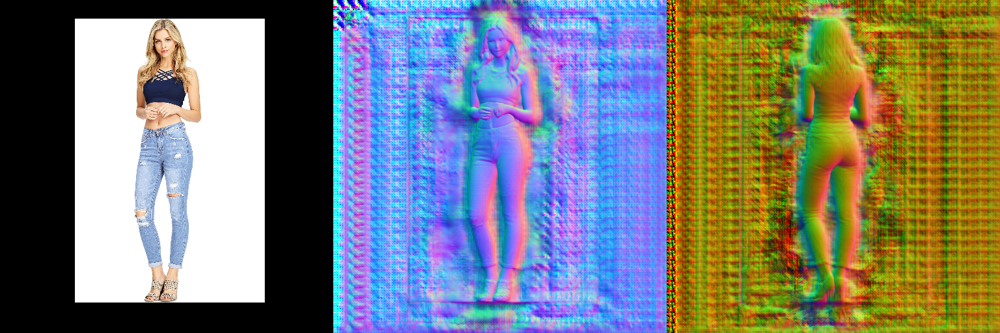

# 第 10 章 计算机视觉课题研究初探

作者: 张伟 (Charmve)

日期: 2021/04/29

## 目录

  - 第 10 章 [计算机视觉课题研究初探](https://charmve.github.io/computer-vision-in-action/#/chapter10/chapter10)
    - 10.1 [手写字识别](https://blog.csdn.net/Charmve/article/details/108531735)
    - 10.2 [文本检测](https://github.com/Charmve/Scene-Text-Detection)
    - 10.3 [车道线检测](https://github.com/Charmve/Awesome-Lane-Detection)
      - 10.3.1 常用网络 
      - 10.3.2 [实战项目 9 - 车道线检测项目实战](https://blog.csdn.net/Charmve/article/details/116678477)
    - 10.4 [镜面检测](https://github.com/Charmve/Mirror-Glass-Detection)
    - 10.5 [图像抠图/Matting](https://github.com/Charmve/TimeWarp)
    - 10.6 [图像超分辨率](charpter10_6-图像超分辨率.md)
    - 10.7 [3D 重建](charpter10_7-3D重建.md)
    - 小结
    - 参考文献

---

# 10.7 3D 重建

    

comming soon ...