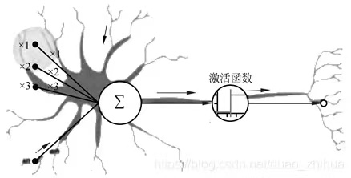

# 第 9 章 检测与分割实战项目

  - 9.1 语义分割
    - 9.1.1 [语义分割 PyTorch 版](https://github.com/Charmve/Semantic-Segmentation-PyTorch)
    - 9.1.2 实战项目 6 
  - 9.2 目标检测
    - 9.2.1 常用网络
    - 9.2.2 实战项目 7 
  - 9.3 实例分割 
    - 9.3.1 常用网络 
    - 9.3.2 实战项目 8
    - 9.3.3 新方法：滑动窗口, PointRend, PolarMask
  - 小结
  - 参考文献

# 9.3 实例分割

作者: 张伟 (Charmve)

日期: 2021/06/06

## 9.3.1 常用网络 

图9.1 神经元-激活函数

## 9.3.2 实战项目 8 

## 9.3.3 新方法：滑动窗口, PointRend, PolarMask

