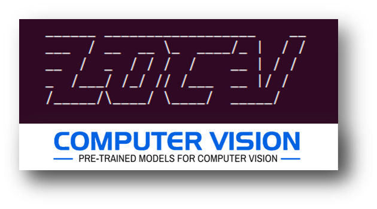

# Computer Vision Pretrained Models

<p align="center">
  
</p>

## What is pre-trained Model?
A pre-trained model is a model created by some one else to solve a similar problem. Instead of building a model from scratch to solve a similar problem, we can use the model trained on other problem as a starting point. A pre-trained model may not be 100% accurate in your application.

For example, if you want to build a self learning car. You can spend years to build a decent image recognition algorithm from scratch or you can take inception model (a pre-trained model) from Google which was built on [ImageNet](http://www.image-net.org/) data to identify images in those pictures.

### Model visualization
You can see visualizations of each model's network architecture by using [Netron](https://github.com/lutzroeder/Netron).


### PyTorch <a name="pytorch"/>

| Model Name | Description | Framework | License |
|   :---:      |     :---:      |     :---:     |     :---:     |
|[detectron2](https://github.com/facebookresearch/detectron2) | Detectron2 is Facebook AI Research's next generation software system that implements state-of-the-art object detection algorithms | `PyTorch` | [Apache License 2.0](https://raw.githubusercontent.com/facebookresearch/detectron2/master/LICENSE) 
| [FastPhotoStyle]( https://github.com/NVIDIA/FastPhotoStyle)  | A Closed-form Solution to Photorealistic Image Stylization.   | `PyTorch`| [Creative Commons Attribution-NonCommercial-ShareAlike 4.0 International Public Licens]( https://raw.githubusercontent.com/NVIDIA/FastPhotoStyle/master/LICENSE.md )
| [pytorch-CycleGAN-and-pix2pix]( https://github.com/junyanz/pytorch-CycleGAN-and-pix2pix)  | A Closed-form Solution to Photorealistic Image Stylization.   | `PyTorch`| [BSD License]( https://raw.githubusercontent.com/junyanz/pytorch-CycleGAN-and-pix2pix/master/LICENSE )
| [maskrcnn-benchmark]( https://github.com/facebookresearch/maskrcnn-benchmark)  | Fast, modular reference implementation of Instance Segmentation and Object Detection algorithms in PyTorch.   | `PyTorch`| [MIT License]( https://raw.githubusercontent.com/facebookresearch/maskrcnn-benchmark/master/LICENSE )
| [deep-image-prior]( https://github.com/DmitryUlyanov/deep-image-prior)  | Image restoration with neural networks but without learning.   | `PyTorch`| [Apache License 2.0]( https://raw.githubusercontent.com/DmitryUlyanov/deep-image-prior/master/LICENSE )
| [StarGAN]( https://github.com/yunjey/StarGAN)  | StarGAN: Unified Generative Adversarial Networks for Multi-Domain Image-to-Image Translation.   | `PyTorch`| [MIT License]( https://raw.githubusercontent.com/yunjey/StarGAN/master/LICENSE )
| [faster-rcnn.pytorch]( https://github.com/jwyang/faster-rcnn.pytorch)  | This project is a faster faster R-CNN implementation, aimed to accelerating the training of faster R-CNN object detection models.   | `PyTorch`| [MIT License]( https://raw.githubusercontent.com/jwyang/faster-rcnn.pytorch/master/LICENSE )
| [pix2pixHD]( https://github.com/NVIDIA/pix2pixHD)  | Synthesizing and manipulating 2048x1024 images with conditional GANs.  | `PyTorch`| [BSD License]( https://raw.githubusercontent.com/NVIDIA/pix2pixHD/master/LICENSE.txt )
| [Augmentor]( https://github.com/mdbloice/Augmentor)  | Image augmentation library in Python for machine learning.  | `PyTorch`| [MIT License]( https://raw.githubusercontent.com/mdbloice/Augmentor/master/LICENSE.md )
| [albumentations]( https://github.com/albumentations-team/albumentations)  | Fast image augmentation library.   | `PyTorch`| [MIT License]( https://raw.githubusercontent.com/albumentations-team/albumentations/master/LICENSE )
| [Deep Video Analytics]( https://github.com/AKSHAYUBHAT/DeepVideoAnalytics)  | Deep Video Analytics is a platform for indexing and extracting information from videos and images   | `PyTorch`| [Custom]( https://raw.githubusercontent.com/AKSHAYUBHAT/DeepVideoAnalytics/master/LICENSE )
| [semantic-segmentation-pytorch]( https://github.com/CSAILVision/semantic-segmentation-pytorch)  | Pytorch implementation for Semantic Segmentation/Scene Parsing on MIT ADE20K dataset.   | `PyTorch`| [BSD 3-Clause License]( https://raw.githubusercontent.com/CSAILVision/semantic-segmentation-pytorch/master/LICENSE )
| [An End-to-End Trainable Neural Network for Image-based Sequence Recognition]( https://github.com/bgshih/crnn)  | This software implements the Convolutional Recurrent Neural Network (CRNN), a combination of CNN, RNN and CTC loss for image-based sequence recognition tasks, such as scene text recognition and OCR.   | `PyTorch`| [The MIT License (MIT)]( https://raw.githubusercontent.com/bgshih/crnn/master/LICENSE )
| [UNIT]( https://github.com/mingyuliutw/UNIT)  | PyTorch Implementation of our Coupled VAE-GAN algorithm for Unsupervised Image-to-Image Translation.   | `PyTorch`| [Creative Commons Attribution-NonCommercial-ShareAlike 4.0 International Public License]( https://raw.githubusercontent.com/mingyuliutw/UNIT/master/LICENSE.md )
| [Neural Sequence labeling model]( https://github.com/jiesutd/NCRFpp)  | Sequence labeling models are quite popular in many NLP tasks, such as Named Entity Recognition (NER), part-of-speech (POS) tagging and word segmentation.   | `PyTorch`| [Apache License]( https://raw.githubusercontent.com/jiesutd/NCRFpp/master/LICENCE )
| [faster rcnn]( https://github.com/longcw/faster_rcnn_pytorch)  | This is a PyTorch implementation of Faster RCNN. This project is mainly based on py-faster-rcnn and TFFRCNN. For details about R-CNN please refer to the paper Faster R-CNN: Towards Real-Time Object Detection with Region Proposal Networks by Shaoqing Ren, Kaiming He, Ross Girshick, Jian Sun.   | `PyTorch`| [MIT License]( https://raw.githubusercontent.com/longcw/faster_rcnn_pytorch/master/LICENSE )
| [pytorch-semantic-segmentation]( https://github.com/ZijunDeng/pytorch-semantic-segmentation)  | PyTorch for Semantic Segmentation.   | `PyTorch`| [MIT License]( https://raw.githubusercontent.com/ZijunDeng/pytorch-semantic-segmentation/master/LICENSE )
| [EDSR-PyTorch]( https://github.com/thstkdgus35/EDSR-PyTorch)  | PyTorch version of the paper 'Enhanced Deep Residual Networks for Single Image Super-Resolution'.   | `PyTorch`| [MIT License]( https://raw.githubusercontent.com/thstkdgus35/EDSR-PyTorch/master/LICENSE )
| [image-classification-mobile]( https://github.com/osmr/imgclsmob)  | Collection of classification models pretrained on the ImageNet-1K.   | `PyTorch`| [MIT License]( https://raw.githubusercontent.com/osmr/imgclsmob/master/LICENSE )
| [FaderNetworks]( https://github.com/facebookresearch/FaderNetworks)  | Fader Networks: Manipulating Images by Sliding Attributes - NIPS 2017.   | `PyTorch`| [Creative Commons Attribution-NonCommercial 4.0 International Public License]( https://raw.githubusercontent.com/facebookresearch/FaderNetworks/master/LICENSE )
| [neuraltalk2-pytorch]( https://github.com/ruotianluo/ImageCaptioning.pytorch)  | Image captioning model in pytorch (finetunable cnn in branch with_finetune).   | `PyTorch`| [MIT License]( https://raw.githubusercontent.com/ruotianluo/ImageCaptioning.pytorch/master/LICENSE )
| [RandWireNN]( https://github.com/seungwonpark/RandWireNN)  | Implementation of: "Exploring Randomly Wired Neural Networks for Image Recognition".   | `PyTorch`| Not Found
| [stackGAN-v2]( https://github.com/hanzhanggit/StackGAN-v2)  |Pytorch implementation for reproducing StackGAN_v2 results in the paper StackGAN++.   | `PyTorch`| [MIT License]( https://raw.githubusercontent.com/hanzhanggit/StackGAN-v2/master/LICENSE )
| [Detectron models for Object Detection]( https://github.com/ignacio-rocco/detectorch)  | This code allows to use some of the Detectron models for object detection from Facebook AI Research with PyTorch.   | `PyTorch`| [Apache License]( https://raw.githubusercontent.com/ignacio-rocco/detectorch/master/LICENSE )
| [DEXTR-PyTorch]( https://github.com/scaelles/DEXTR-PyTorch)  | This paper explores the use of extreme points in an object (left-most, right-most, top, bottom pixels) as input to obtain precise object segmentation for images and videos.   | `PyTorch`| [GNU GENERAL PUBLIC LICENSE]( https://raw.githubusercontent.com/scaelles/DEXTR-PyTorch/master/LICENSE )
| [pointnet.pytorch]( https://github.com/fxia22/pointnet.pytorch)  | Pytorch implementation for "PointNet: Deep Learning on Point Sets for 3D Classification and Segmentation.   | `PyTorch`| [MIT License]( https://raw.githubusercontent.com/fxia22/pointnet.pytorch/master/LICENSE )
| [self-critical.pytorch]( https://github.com/ruotianluo/self-critical.pytorch) | This repository includes the unofficial implementation Self-critical Sequence Training for Image Captioning and Bottom-Up and Top-Down Attention for Image Captioning and Visual Question Answering.   | `PyTorch`| [MIT License]( https://raw.githubusercontent.com/ruotianluo/self-critical.pytorch/master/LICENSE )
| [vnet.pytorch]( https://github.com/mattmacy/vnet.pytorch)  | A Pytorch implementation for V-Net: Fully Convolutional Neural Networks for Volumetric Medical Image Segmentation.   | `PyTorch`| [BSD 3-Clause License]( https://raw.githubusercontent.com/mattmacy/vnet.pytorch/master/LICENSE )
| [piwise]( https://github.com/bodokaiser/piwise)  | Pixel-wise segmentation on VOC2012 dataset using pytorch.   | `PyTorch`| [BSD 3-Clause License]( https://raw.githubusercontent.com/bodokaiser/piwise/master/LICENSE.md )
| [pspnet-pytorch]( https://github.com/Lextal/pspnet-pytorch)  | PyTorch implementation of PSPNet segmentation network.   | `PyTorch`| Not Found
| [pytorch-SRResNet]( https://github.com/twtygqyy/pytorch-SRResNet)  | Pytorch implementation for Photo-Realistic Single Image Super-Resolution Using a Generative Adversarial Network.   | `PyTorch`| [The MIT License (MIT)]( https://raw.githubusercontent.com/twtygqyy/pytorch-SRResNet/master/LICENSE )
| [PNASNet.pytorch]( https://github.com/chenxi116/PNASNet.pytorch)  | PyTorch implementation of PNASNet-5 on ImageNet.   | `PyTorch`| [Apache License]( https://raw.githubusercontent.com/chenxi116/PNASNet.pytorch/master/LICENSE )
| [img_classification_pk_pytorch]( https://github.com/felixgwu/img_classification_pk_pytorch)  | Quickly comparing your image classification models with the state-of-the-art models.   | `PyTorch`| Not Found
| [Deep Neural Networks are Easily Fooled]( https://github.com/utkuozbulak/pytorch-cnn-adversarial-attacks)  | High Confidence Predictions for Unrecognizable Images.   | `PyTorch`| [MIT License]( https://raw.githubusercontent.com/utkuozbulak/pytorch-cnn-adversarial-attacks/master/LICENSE )
| [pix2pix-pytorch]( https://github.com/mrzhu-cool/pix2pix-pytorch)  | PyTorch implementation of "Image-to-Image Translation Using Conditional Adversarial Networks".   | `PyTorch`| Not Found
| [NVIDIA/semantic-segmentation]( https://github.com/NVIDIA/semantic-segmentation)  | A PyTorch Implementation of Improving Semantic Segmentation via Video Propagation and Label Relaxation, In CVPR2019.   | `PyTorch`| [CC BY-NC-SA 4.0 license]( https://raw.githubusercontent.com/NVIDIA/semantic-segmentation/master/LICENSE )
| [Neural-IMage-Assessment]( https://github.com/kentsyx/Neural-IMage-Assessment)  | A PyTorch Implementation of Neural IMage Assessment.   | `PyTorch`| Not Found
| [torchxrayvision](https://github.com/mlmed/torchxrayvision) | Pretrained models for chest X-ray (CXR) pathology predictions. Medical, Healthcare, Radiology  | `PyTorch` | [Apache License]( https://raw.githubusercontent.com/mlmed/torchxrayvision/master/LICENSE ) |
| [pytorch-image-models](https://github.com/rwightman/pytorch-image-models) | PyTorch image models, scripts, pretrained weights -- (SE)ResNet/ResNeXT, DPN, EfficientNet, MixNet, MobileNet-V3/V2, MNASNet, Single-Path NAS, FBNet, and more  | `PyTorch` | [Apache License 2.0]( https://github.com/rwightman/pytorch-image-models/blob/master/LICENSE ) |

* comes from [<b><em>balavenkatesh3322/CV-pretrained-model</em></b>](https://github.com/balavenkatesh3322/CV-pretrained-model)

<div align="right">
    <b><a href="#index">↥ Back To Top</a></b>
</div>

### Tensorflow <a name="tensorflow"/>

| Model Name | Description | Framework | License |
|   :---:      |     :---:      |     :---:     |     :---:     |
| [ObjectDetection]( https://github.com/tensorflow/models/tree/master/research/object_detection)  | Localizing and identifying multiple objects in a single image.| `Tensorflow`| [Apache License]( https://raw.githubusercontent.com/tensorflow/models/master/LICENSE )
| [Mask R-CNN]( https://github.com/matterport/Mask_RCNN)  | The model generates bounding boxes and segmentation masks for each instance of an object in the image. It's based on Feature Pyramid Network (FPN) and a ResNet101 backbone.     | `Tensorflow`| [The MIT License (MIT)]( https://raw.githubusercontent.com/matterport/Mask_RCNN/master/LICENSE )
| [Faster-RCNN]( https://github.com/smallcorgi/Faster-RCNN_TF)  | This is an experimental Tensorflow implementation of Faster RCNN - a convnet for object detection with a region proposal network.     | `Tensorflow`| [MIT License]( https://raw.githubusercontent.com/smallcorgi/Faster-RCNN_TF/master/LICENSE )
| [YOLO TensorFlow]( https://github.com/gliese581gg/YOLO_tensorflow)  | This is tensorflow implementation of the YOLO:Real-Time Object Detection.     | `Tensorflow`| [Custom]( https://raw.githubusercontent.com/gliese581gg/YOLO_tensorflow/master/LICENSE )
| [YOLO TensorFlow ++]( https://github.com/thtrieu/darkflow)  | TensorFlow implementation of 'YOLO: Real-Time Object Detection', with training and an actual support for real-time running on mobile devices.     | `Tensorflow`| [GNU GENERAL PUBLIC LICENSE]( https://raw.githubusercontent.com/thtrieu/darkflow/master/LICENSE )
| [MobileNet]( https://github.com/tensorflow/models/blob/master/research/slim/nets/mobilenet_v1.md)  | MobileNets trade off between latency, size and accuracy while comparing favorably with popular models from the literature.     | `Tensorflow`| [The MIT License (MIT)]( https://raw.githubusercontent.com/tensorflow/models/master/LICENSE )
| [DeepLab]( https://github.com/tensorflow/models/tree/master/research/deeplab)  | Deep labeling for semantic image segmentation.     | `Tensorflow`| [Apache License]( https://raw.githubusercontent.com/tensorflow/models/master/LICENSE )
| [Colornet]( https://github.com/pavelgonchar/colornet)  | Neural Network to colorize grayscale images.     | `Tensorflow`| Not Found
| [SRGAN]( https://github.com/tensorlayer/srgan)  | Photo-Realistic Single Image Super-Resolution Using a Generative Adversarial Network.    | `Tensorflow`| Not Found
| [DeepOSM]( https://github.com/trailbehind/DeepOSM)  | Train TensorFlow neural nets with OpenStreetMap features and satellite imagery.     | `Tensorflow`| [The MIT License (MIT)]( https://raw.githubusercontent.com/trailbehind/DeepOSM/master/LICENSE )
| [Domain Transfer Network]( https://github.com/yunjey/domain-transfer-network)  | Implementation of Unsupervised Cross-Domain Image Generation.  | `Tensorflow`| [MIT License]( https://raw.githubusercontent.com/yunjey/domain-transfer-network/master/LICENSE )
| [Show, Attend and Tell]( https://github.com/yunjey/show-attend-and-tell)  | Attention Based Image Caption Generator.     | `Tensorflow`| [MIT License]( https://raw.githubusercontent.com/yunjey/show-attend-and-tell/master/LICENSE )
| [android-yolo]( https://github.com/natanielruiz/android-yolo)  | Real-time object detection on Android using the YOLO network, powered by TensorFlow.    | `Tensorflow`| [Apache License]( https://raw.githubusercontent.com/natanielruiz/android-yolo/master/LICENSE )
| [DCSCN Super Resolution]( https://github.com/jiny2001/dcscn-super-resolutiont)  | This is a tensorflow implementation of "Fast and Accurate Image Super Resolution by Deep CNN with Skip Connection and Network in Network", a deep learning based Single-Image Super-Resolution (SISR) model.     | `Tensorflow`| Not Found
| [GAN-CLS]( https://github.com/zsdonghao/text-to-image)  | This is an experimental tensorflow implementation of synthesizing images.     | `Tensorflow`| Not Found
| [U-Net]( https://github.com/zsdonghao/u-net-brain-tumor)  | For Brain Tumor Segmentation.     | `Tensorflow`| Not Found
| [Improved CycleGAN]( https://github.com/luoxier/CycleGAN_Tensorlayer)  |Unpaired Image to Image Translation.     | `Tensorflow`| [MIT License]( https://raw.githubusercontent.com/luoxier/CycleGAN_Tensorlayer/master/LICENSE )
| [Im2txt]( https://github.com/tensorflow/models/tree/master/research/im2txt)  | Image-to-text neural network for image captioning.     | `Tensorflow`| [Apache License]( https://raw.githubusercontent.com/tensorflow/models/master/LICENSE )
| [SLIM]( https://github.com/tensorflow/models/tree/master/research/slim)  | Image classification models in TF-Slim.     | `Tensorflow`| [Apache License]( https://raw.githubusercontent.com/tensorflow/models/master/LICENSE )
| [DELF]( https://github.com/tensorflow/models/tree/master/research/delf)  | Deep local features for image matching and retrieval.     | `Tensorflow`| [Apache License]( https://raw.githubusercontent.com/tensorflow/models/master/LICENSE )
| [Compression]( https://github.com/tensorflow/models/tree/master/research/compression)  | Compressing and decompressing images using a pre-trained Residual GRU network.     | `Tensorflow`| [Apache License]( https://raw.githubusercontent.com/tensorflow/models/master/LICENSE )
| [AttentionOCR]( https://github.com/tensorflow/models/tree/master/research/attention_ocr)  | A model for real-world image text extraction.     | `Tensorflow`| [Apache License]( https://raw.githubusercontent.com/tensorflow/models/master/LICENSE )

* comes from [<b><em>balavenkatesh3322/CV-pretrained-model</em></b>](https://github.com/balavenkatesh3322/CV-pretrained-model)

<div align="right">
    <b><a href="#index">↥ Back To Top</a></b>
</div>


# Repo: Semantic Segmentation in PyTorch
This repository contains some models for semantic segmentation and the pipeline of training and testing models, 
implemented in PyTorch.

https://github.com/Charmve/Semantic-Segmentation-PyTorch

## Models
1. Vanilla FCN: FCN32, FCN16, FCN8, in the versions of VGG, ResNet and DenseNet respectively
([Fully convolutional networks for semantic segmentation](http://www.cv-foundation.org/openaccess/content_cvpr_2015/papers/Long_Fully_Convolutional_Networks_2015_CVPR_paper.pdf))
2. U-Net ([U-net: Convolutional networks for biomedical image segmentation](https://arxiv.org/pdf/1505.04597))
3. SegNet ([Segnet: A deep convolutional encoder-decoder architecture for image segmentation](https://arxiv.org/pdf/1511.00561))
4. PSPNet ([Pyramid scene parsing network](https://arxiv.org/pdf/1612.01105))
5. GCN ([Large Kernel Matters](https://arxiv.org/pdf/1703.02719))
6. DUC, HDC ([understanding convolution for semantic segmentation](https://arxiv.org/pdf/1702.08502.pdf))
7. Mask-RCNN ([paper](https://arxiv.org/abs/1703.06870), [code from FAIR](https://github.com/facebookresearch/Detectron), [<b>code PyTorch</b>](https://github.com/multimodallearning/pytorch-mask-rcnn))

## Requirement
1. PyTorch 0.2.0
2. TensorBoard for PyTorch. [Here](https://github.com/lanpa/tensorboard-pytorch)  to install
3. Some other libraries (find what you miss when running the code :-P)

## Preparation
1. Go to ``*models*`` directory and set the path of pretrained models in ``*config.py*``
2. Go to ``*datasets*`` directory and do following the ``README``

## TODO
I'm going to implement <a href="https://github.com/Charmve/PaperWeeklyAI/tree/master/05_Image%20Segmentation" target="_blank"><i>The Image Segmentation Paper Top10 Net</i></a> in PyTorch firstly.

- [ ] DeepLab v3  
- [ ] RefineNet 
- [ ] ImageNet
- [ ] GoogleNet
- [ ] More dataset (e.g. ADE)

## Citation
Use this bibtex to cite this repository:
```
@misc{PyTorch for Semantic Segmentation in Action,
  title={Some Implementations of Semantic Segmentation in PyTorch},
  author={Charmve},
  year={2020.10},
  publisher={Github},
  journal={GitHub repository},
  howpublished={\url{https://github.com/Charmve/Semantic-Segmentation-PyTorch}},
}
```

